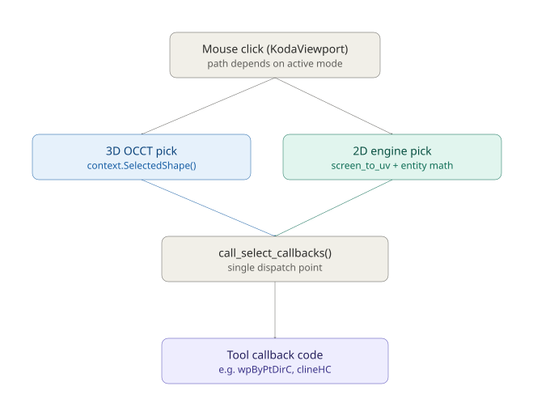

# How a mouse click becomes a point

KodaCAD has two genuinely different ways of turning a mouse click into
a usable coordinate, and which one runs depends entirely on which mode
a tool armed before you clicked. This has bitten us more than once
(see `DEVELOPMENT_LOG.md`, Session 63/64), so it's worth writing down
properly.

## The shape of it

One entry point, a fork, one convergence. The fork is the part worth
understanding; the convergence is why tool code doesn't have to care
which side of the fork it came from.

## The fork

**3D OCCT pick.** Used by anything that picks real 3D geometry --
`wpBy3Pts`, `wpByPtDir` (Point & Direction workplane), the revolve
axis picker, project-face. Before the click, the tool calls something
like `display.SetSelectionModeVertex()`. That's a method on
`DisplayShim` and it tells OCCT's own `AIS_InteractiveContext` --
the geometry kernel's built-in selection manager -- which `TopAbs`
shape types are eligible targets right now (vertex, edge, face...).
OCCT does its own hit-testing against the actual displayed geometry.
`context.SelectedShape()` hands back whatever it found.

**2D engine pick.** Used by nearly every sketching tool in `m2d.py`
(H/V clines, the bisectors, fillet, slot...). OCCT's selection system
is barely involved here. The click's raw *pixel coordinates* ride
along as an extra argument to the callback, and
`snap_engine.screen_to_uv()` converts them into workplane UV
coordinates. Everything past that point is plain Python math against
the workplane's own data -- `wp.clines`, `wp.ccircs`, `wp.csegs` --
searching for the nearest candidate entity by distance. OCCT never
"selects" anything in this path; the engine does geometry, not
selection.

These are philosophically different pickers solving the same problem
two different ways -- one delegates to the CAD kernel, one is pure
coordinate math against the sketch's own data structures.

## The convergence

Both paths land in `call_select_callbacks()`, which doesn't know or
care which path produced its input. It just hands the result to
whatever function a tool registered with `win.registerCallback(...)`.
That's why `wpByPtDirC` and `clineHC` can be written without any
awareness of which pipeline delivered their point -- the dispatcher
is the seam between "how the point was found" and "what the tool does
with it."

## Hover runs the same pattern in parallel

`mouseMoveEvent` walks a *separate* list, `_move_callbacks`, instead
of `_select_callbacks`. This is how the yellow catch-square (2D) and
the cyan circular-edge-center marker (3D, added in Session 63/64) stay
live and update continuously without you ever clicking -- they're
just move callbacks doing their own hover-time resolution, using the
identical fork described above (OCCT hit-testing for 3D, UV math for
2D).

## The trap: two classes, one `self`

`SetSelectionModeVertex` and friends are methods on `DisplayShim`.
`_on_click` and `_center_pick_hover` are methods on the *separate*
`KodaViewport` class. `DisplayShim` holds a reference to its owning
viewport as `self._viewport` -- but a bare `self` inside a `DisplayShim`
method binds to the `DisplayShim` instance, not the viewport, even
though conceptually the state you're setting is "about" the viewport.

This bit us for real: a flag meant to reach `_on_click` was set with a
bare `self` inside a `DisplayShim` method, silently landing on the
wrong object. `_on_click` never saw it, and clicks fell through to
tool code holding a raw `Edge` shape when a `Vertex` was expected.

**The standing rule:** any time a shim/wrapper class sets state meant
for its owner, name the owner explicitly (`self._viewport.whatever`),
never trust a bare `self` to mean what it conceptually should.

## See also

- `DEVELOPMENT_LOG.md` -- Session 63/64 for the full incident this
  document was extracted from, including the Ctrl+Shift
  circular-edge-center feature that motivated writing it down.
- `SKETCH_ENGINE_DESIGN.md` -- the 2D engine's own internals (the
  catch/gesture/direction input taxonomy) once a click has already
  arrived as a UV coordinate.
