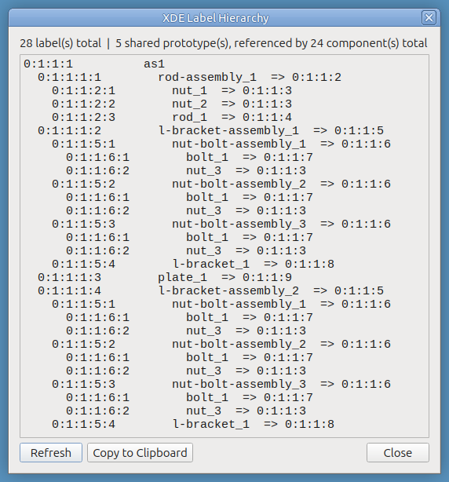
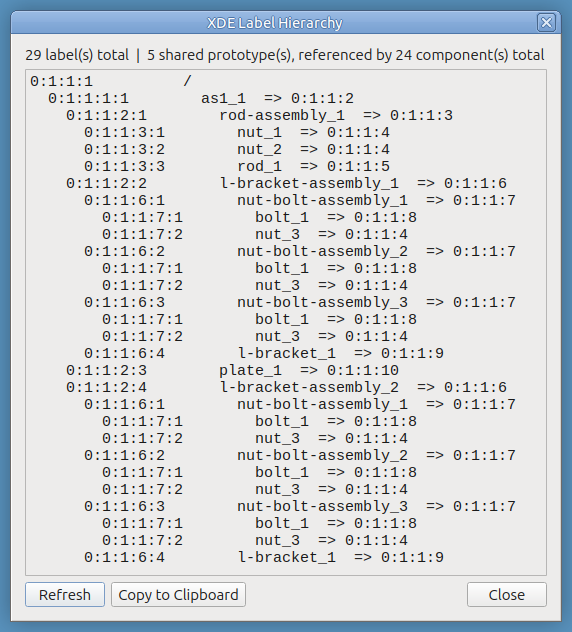
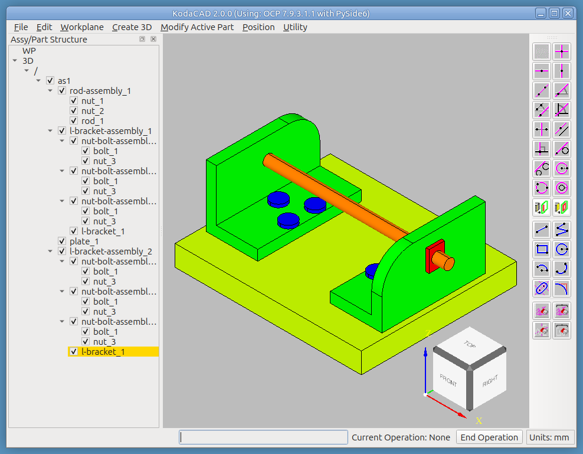

# Tutorial: Assembly Structure with `as1-oc-214.stp`

Where the OCC Bottle tutorial builds a single part from nothing, this
one is about KodaCAD's handling of an assembly that already exists.
`as1-oc-214.stp` is a genuine multi-part assembly (a top assembly
`as1`, with a pair of shared L-bracket assemblies among its
components) -- the natural file for exercising how KodaCAD loads,
displays, and modifies structure it didn't just build itself.

This tutorial covers only the material specific to *this* file. Sibling-
assembly creation, reparenting, creating and positioning a shared
instance from scratch, and undo/redo across a mixed chain of
operations are covered instead by the [Quaoar Chassis
tutorial](../chassis/README.md), which builds that structure directly
rather than exploring a pre-built one -- a more concrete way to
exercise the same mechanisms.

## What this exercises

Both STEP loading paths and why each is safe against `/` accumulation;
the XDE hierarchy viewer; recognizing a shared prototype from its
referring components; fillet propagation across two *pre-existing*
shared instances (as opposed to the Chassis tutorial's freshly-created
one).

---

## Step 1 -- Load the file two ways, and see why each is safe

1. **File -> Load Session**, choose `as1-oc-214.stp`. The assembly
   appears under `/` -- this *replaces* whatever was open.
2. Undo back to empty (or restart), then **File -> Import STEP**,
   choose the same file. This time it's *added* as a new component
   under the current `/`, alongside anything else already open.

Load file `as1-oc-214.stp` as session | Import file `as1-oc-214.stp` into empty session
-------------|--------------
 | 

*Exercises: the two loading mechanisms documented in the README's
"Loading a STEP file" section -- Load Session replaces the whole
document (structurally immune to `/` accumulation), Import STEP adds
under the existing root (the one path that explicitly unwraps a
saved-session's own `/` wrapper before nesting its children).*

## Step 2 -- Explore the structure

**Utility -> XDE Label Hierarchy...** Walk the tree that opens.

Note which labels are components (occurrences, referring to a
prototype) versus the prototypes themselves.

Load file `as1-oc-214.stp` as session | Import file `as1-oc-214.stp` into empty session
-------------|--------------
 | 

*Exercises: XDE hierarchy viewer; recognizing a shared prototype from
its referring components.*

## Step 3 -- Fillet a shared part

Set one of the shared L-bracket instances active, **Modify Active
Part -> Fillet** on one of its corners. Confirm *both* L-brackets
(every instance sharing that prototype) show the fillet, not just the
one you picked.

*Exercises: fillet's propagation to every instance sharing a
prototype -- a prior bug left sibling instances' displays stale even
though the underlying shared geometry was already correct. Doing this
on `as1-oc-214.stp` specifically (rather than a freshly-created shared
instance, as in the Chassis tutorial) confirms the fix also holds for
sharing relationships that came in from an imported file rather than
being built in the current session.*

---

## Notes for whoever runs this next

- If any menu label, dialog control name, or button text has drifted
  from what's written here, that's worth fixing in this document
  directly -- catching that drift is exactly what this tutorial is
  for.
- See the [Quaoar Chassis tutorial](../chassis/README.md) for the
  broader assembly-construction workflow: creating sibling assemblies,
  reparenting, creating and positioning a shared instance, and
  undo/redo across a mixed chain of position- and shape-changing
  operations.
