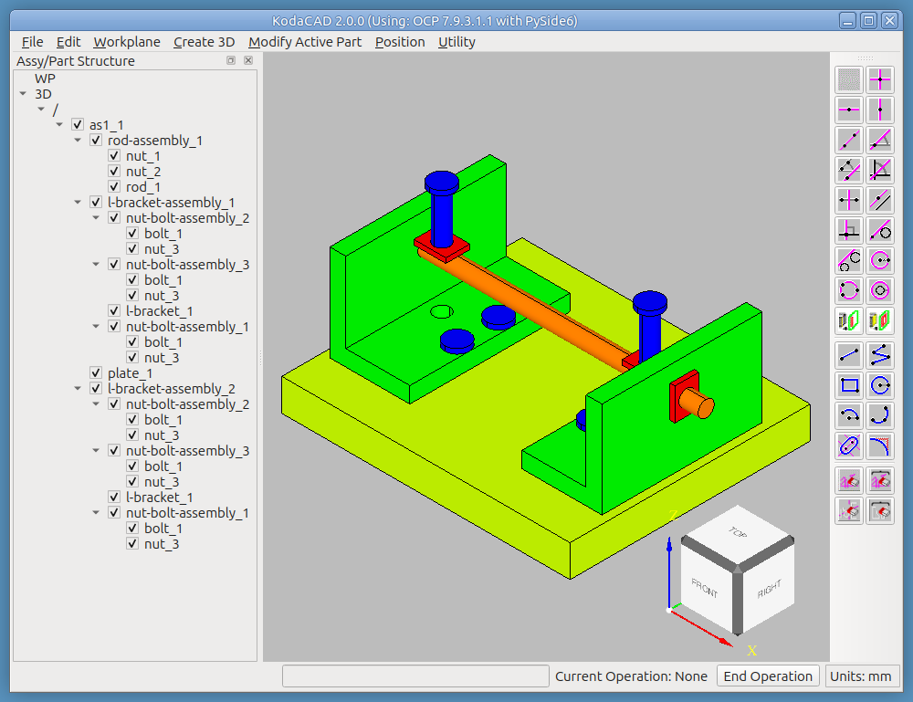

# Tutorial: Assembly Structure with `as1-oc-214.stp`

Where the OCC Bottle tutorial builds a single part from nothing, this
one is about KodaCAD's handling of an assembly that already exists.
`as1-oc-214.stp` is a genuine multi-part assembly (a top assembly
`as1`, with a pair of shared L-bracket assemblies among its
components) -- the natural file for exercising how KodaCAD loads,
displays, and modifies structure it didn't just build itself.

This tutorial covers only the material specific to *this* file. Sibling-
assembly creation, reparenting, creating and positioning a shared
instance from scratch, and undo/redo across a mixed chain of
operations are covered instead by the [Quaoar Chassis
tutorial](../chassis/README.md), which builds that structure directly
rather than exploring a pre-built one -- a more concrete way to
exercise the same mechanisms.

## What this exercises

Both STEP loading paths and why each is safe against `/` accumulation;
the XDE hierarchy viewer; recognizing a shared prototype from its
referring components; fillet propagation across two *pre-existing*
shared instances (as opposed to the Chassis tutorial's freshly-created
one).

---

## Step 1 -- Load the file two ways, and see why each is safe

1. **File -> Load Session**, choose `as1-oc-214.stp`. The assembly
   appears under `/` -- this *replaces* whatever was open.
2. Alternatively, you can restart KodaCAD, then **File -> Import STEP**,
   choose the same file. This time it's *added* as a new component
   under the current `/`, alongside anything else already open. 

> **A note on Undo/Redo after Import STEP:** if this is the first thing you've brought into an empty session, Undo and Redo have one quirk worth knowing. Undoing once and then Redoing works perfectly — you'll get your import back every time. But if you Undo twice in a row right after that first import (past the point where the assembly disappears), Redo will no longer bring it back, and you'll need to restart KodaCAD to get a clean session again.

> In practice: after your first-ever import, don't click Undo more than once unless you're sure you want to go further back — after that, Redo may not work. **Load Session doesn't have this limitation at all**, which is worth keeping in mind if you're the type to click Undo a few extra times "just to be safe."

Load file `as1-oc-214.stp` as session | Import file `as1-oc-214.stp` into empty session
-------------|--------------
 | 

*Exercises: the two loading mechanisms documented in the README's
"Loading a STEP file" section -- Load Session replaces the whole
document (structurally immune to `/` accumulation), Import STEP adds
under the existing root (the one path that explicitly unwraps a
saved-session's own `/` wrapper before nesting its children).*

## Step 2 -- Explore the structure

**Utility -> XDE Label Hierarchy...** Walk the tree that opens.

Note which labels are components (occurrences, referring to a
prototype) versus the prototypes themselves.

Load file `as1-oc-214.stp` as session | Import file `as1-oc-214.stp` into empty session
-------------|--------------
 | 

*Exercises: XDE hierarchy viewer; recognizing a shared prototype from
its referring components.*

## Step 3 -- Fillet a shared part

Set one of the shared L-bracket instances active, **Modify Active
Part -> Fillet** on one of its corners. Confirm *both* L-brackets
(every instance sharing that prototype) show the fillet, not just the
one you picked.

*Exercises: fillet's propagation to every instance sharing a
prototype -- a prior bug left sibling instances' displays stale even
though the underlying shared geometry was already correct. Doing this
on `as1-oc-214.stp` specifically (rather than a freshly-created shared
instance, as in the Chassis tutorial) confirms the fix also holds for
sharing relationships that came in from an imported file rather than
being built in the current session.*

## Step 4 -- Bi-directional highlighting between viewport and tree

In the Top-Front-Right isometric view, click on the blue bolt that is farthest away. This causes the bolt to highlight in both the viewport and in the tree. Now click in the background of the viewport and the bolt loses its highlighing in both the tree and viewport. This works both ways. Clicking on the bolt in the tree causes it to also highlight in the viewport. Although this only works for parts (not assemblies), it's pretty straightforward to deduce that the parent assembly in the tree correlates with the parent assembly in the viewport. We will use this knowledge in the next step.

*Exercises: Bi-directional highlighting of parts (not assemblies) between viewport and tree.  This can be very helpful, especially in a large assembly.*

## Step 5 -- Moving a component in a shared assembly causes the component to move in all shared instances of that assembly

In Step 2 above, we learned that the 2 l-bracket-assembly instances refer to a common prototype. The label of the prototype is `0:1:1:5` or `0:1:1:6`, depending on whether the file was loaded as a session or imported. But that doesn't matter. The point is that they are shared.

In this test, we will move the parent nut-bolt-assembly of the bolt we found in Step 4. We expect to see this change in both l-bracket-assembly instances.

1. Select the parent nut-bolt-assembly of the bolt found in Step 4.
2. **Position -> Position Selected**
3. Select **Dynamic**
4. Click and drag using the Z-direction handle to move the assenbly a conspicuous distance.
5. Click **Done** in the Position dialog.

You will see the position of this nut-bolt-assembly change in both l-bracket-assemly instances.

*Exercises: Behavior of moving a component in a shared-instance assembly

## Step 6 -- Create a pair of sibling assemblies

Right-click the top assembly (or an empty area of the tree) →
**Create New Assembly**, twice in a row. Confirm the second assembly
lands as a *sibling* of the first, not nested inside it.

*Exercises: the empty-assembly stack-imbalance fix -- a prior bug
where a second new assembly was silently nested under the first
because of a pop/push mismatch when the first assembly had zero
children.*

## Step 7 -- Reparent a part between assemblies

Drag a part from one assembly into another in the tree. Check its
world position in the viewport before and after -- it should stay
exactly where it visually was, even though its parent (and therefore
its local transform) changed.

*Exercises: reparenting's world-location preservation, including the
assembly-vs-part world-location fix (assemblies weren't originally
found in the same lookup dict simple parts were).*

## Step 8 -- Create a shared instance, then position it

1. Select one of the L-bracket assemblies (or another shared part) →
   right-click → **Create Shared Instance**.
2. **Position → Position Selected** on the new instance. Try, in
   sequence: **Dynamic** (drag with the manipulator), **Nudge** (a
   translate and a rotate, both before and after **Align Gizmo to
   Active Workplane**), **Mate Align** (**Mate**, then **Align**),
   and **2 Points**. Use **Back**/**Reverse** at least once to flip a
   mate result. Click Done to commit.

*Exercises: shared-instance creation; most of the Position dialog's
surface in one pass -- Dynamic drag, Nudge (including the workplane-
relative gizmo realignment), Mate/Align, 2 Points, Back/Reverse.*

## Step 9 -- Undo / Redo

Undo back through the position changes, the shared-
instance creation, the reparenting, the creation of the sibling assemblies, etc, all the way back to the fillet, one step at a time --
confirming each step in the sequence visibly reverts, not just the first one. As long as you don't go all the way back past the loading of the STEP file, you can Redo to get back to the state prior to the first Undo. If you Undo back past the import of the step file, then you've gone too far and Redo may not get you back.

*Exercises: undo/redo's targeted redraw across a genuinely mixed
chain -- both the location-comparison path (position changes) and
the shape-replaced-entries path (the fillet, which changes geometry
without moving anything) have to each correctly identify their own
step, in the right order, without the earlier one's bookkeeping
being cleared before the later ones need it.*

## Step 10 -- Tree checkboxes and expand/collapse

1. Uncheck a part inside an assembly with multiple children, leaving
   at least one sibling checked -- confirm the assembly's own
   checkbox stays checked (derived from its children).
2. Uncheck every child in one assembly -- confirm the assembly's own
   checkbox goes unchecked too.
3. Collapse a branch of the tree, then trigger any rebuild (a fillet,
   a position change, anything that calls `build_tree()`) -- confirm
   the branch stays collapsed rather than snapping back open.

*Exercises: bottom-up assembly checkbox derivation and expand/collapse
persistence across a tree rebuild.*

## Step 12 -- Measure something real

**Rad** or **Ang** on a hole or edge in the assembly (not a freshly-
sketched 2D construction, but real, STEP-imported 3D geometry) to
confirm the calculator's measurement tools work against imported,
not just natively-built, geometry.

*Exercises: Rad/Ang against 3D edges from an imported file, including
the circumcenter fallback for any non-analytic circular edges the
STEP import may have introduced.*

## Step 12 -- Save and reload

Save the whole session as a STEP file, then reload it. Compare file
size and entity count to the original `as1-oc-214.stp` as a rough
sanity check, and confirm the assembly structure -- shared instances
included -- survives the round trip intact.

*Exercises: STEP save/reload on a genuinely multi-part, multi-
assembly file, as a contrast case to the Bottle tutorial's single
bare part -- this is the file shape most real KodaCAD sessions will
actually look like.*

---

## Notes for whoever runs this next

- If any menu label, dialog control name, or button text has drifted
  from what's written here, that's worth fixing in this document
  directly -- catching that drift is exactly what this tutorial is
  for.
- See the [Quaoar Chassis tutorial](../chassis/README.md) for the
  broader assembly-construction workflow: creating sibling assemblies,
  reparenting, creating and positioning a shared instance, and
  undo/redo across a mixed chain of position- and shape-changing
  operations.
