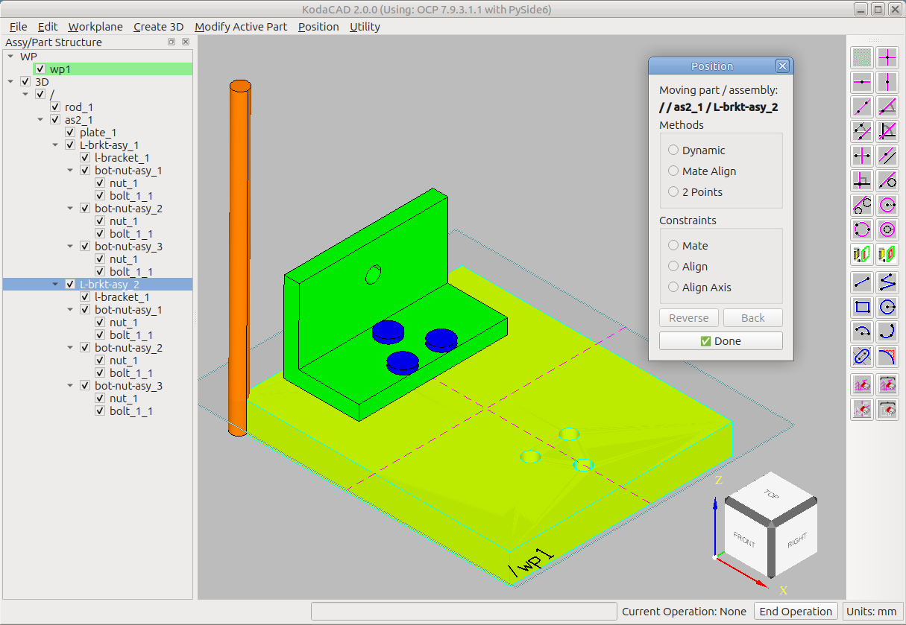
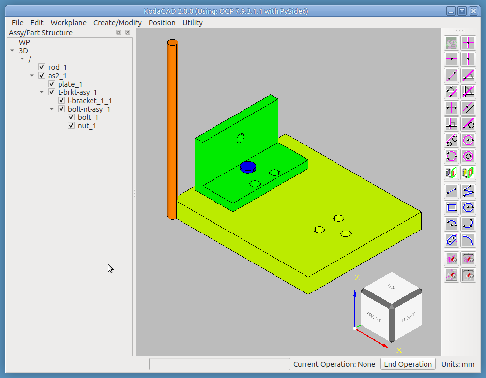
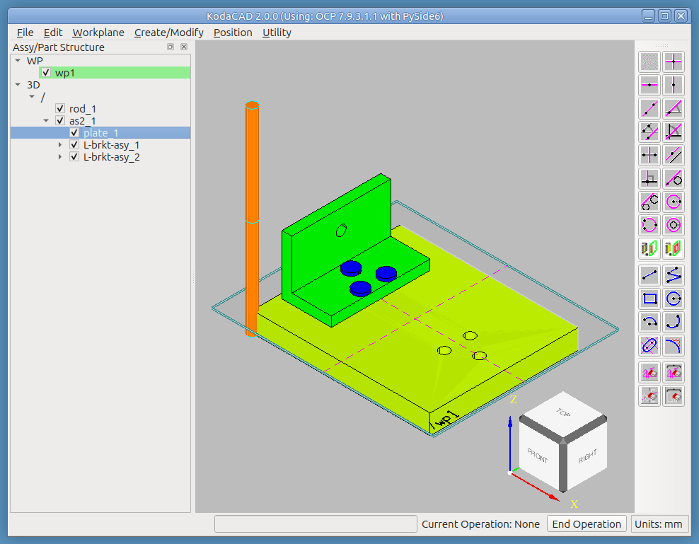

# Tutorial: Build Assembly `as1` from a Kit of Parts

The [Assembly Structure tutorial](../as1-oc-214/README.md) explored an
assembly that already exists. This one goes the other direction:
starting from the five loose, un-positioned parts produced by
`extract_prototypes.py` (see that script, or ask about it if you don't
have the file), we rebuild the real `as1-oc-214` assembly from
scratch -- exercising sibling-assembly creation, shared instances, and
nearly every method the Position dialog offers, all in one continuous
build.

## What you'll need

`as1-oc-214-kit-of-parts.stp` -- five parts (`plate`, `l-bracket`,
`bolt`, `nut`, `rod`), each sitting at the origin where it was
originally modeled, all superimposed on top of each other.

## What this exercises

Import STEP into an empty session; creating a new assembly directly
at the root; drag-reparenting parts into an assembly; the Position
dialog's full method set (Dynamic, Mate Align with all three
constraints -- Mate, Align, and Align Axis -- and 2 Points, including
Ctrl+Shift circle-center picking); shared-instance creation for both a
part and an assembly, including verifying an instance moved
independently of its sibling; workplane-on-face combined with
Align-Gizmo-to-Active-Workplane for a rotation about a specific axis;
and the calculator's Dist tool used mid-build to correct a
positioning error rather than just to inspect a finished model.

---

## Step 1 -- Import the file into an empty session

**File -> Import STEP**, choose `as1-oc-214-kit-of-parts.stp`.

*Exercises: Import STEP into a genuinely empty session -- the parts
land exactly where they were modeled, all overlapping at the origin,
which is the whole reason a "kit of parts" file is useful for this
kind of tutorial.*

## Step 2 -- Begin creating the assembly tree

* RMB click `/` and select **Create New Assembly**. Name it `as2`
  (to differentiate it from the original assembly, named `as1`).
* Drag `plate` into the new `as2` assembly in the tree. It's already
  in the correct position, so no further move is needed.
* RMB click `as2` and select **Create New Assembly**. Name it
  `L-brkt-asy`. (An upper-case `L` here makes it more obvious the
  bracket's shape resembles the letter it's named after.)

*Exercises: creating a new assembly directly at the root in a fresh
session, and creating a second, nested assembly under the first --
confirming both are siblings under their own parent, not accidentally
nested into each other.*

## Step 3 -- Add and position the L-bracket

* Drag `l-bracket` into `L-brkt-asy` in the tree.
* Select it, then **Position -> Position Selected**.

  * Choose method **Mate Align**.
    1. Constraint **Mate** -- click the bottom face of the bracket,
       then the top face of the plate.
    2. Constraint **Align Axis** -- click the cylindrical face of one
       of the holes in the bracket, then the cylindrical face of the
       corresponding hole in the plate.
    3. Constraint **Align** (a third constraint, not always strictly
       needed) -- click the bracket's back (vertical) face, then the
       plate's left side, to guarantee they're parallel.

*Exercises: Mate Align with all three constraint types in one
sequence -- Mate, then Align Axis, then Align. Align Axis is valid
here as the second constraint applied (it can be first or second, but
never the last of the three).*

## Step 4 -- Position the bolt and nut

* Hide the rod first, to make the bolt easier to pick.
* Select `bolt` in the tree, then **Position -> Position Selected**.
  * Choose method **Mate Align**.
    1. Constraint **Align Axis** -- click the bolt's cylindrical
       face, then the cylindrical surface of the target hole in the
       L-bracket.
    2. Constraint **Mate** -- click the underside of the bolt head,
       then the top face of the plate.
* Position the nut in two stages -- first out of the way, then
  precisely:
  * Select `nut`, then **Position -> Position Selected**.
  * Stage 1, method **Dynamic** -- drag the nut a short distance away
    from the plate using the gizmo's handles, just far enough to make
    picking easier.
  * Stage 2, method **2 Points**.
    1. First point: hold **Ctrl+Shift** and click the top edge of the
       nut's cylindrical hole. (Ctrl+Shift while picking a circular
       edge finds its center, not a point on the edge itself.)
    2. Second point: hold **Ctrl+Shift** and click the edge of the
       matching hole in the underside of the plate.

*Exercises: Mate Align with Align Axis used as the FIRST constraint
this time (valid either way, per Step 3's own note); Dynamic used
deliberately as a rough, intermediate move rather than a final one;
2 Points with Ctrl+Shift circle-center picking on a genuinely 3D edge.*

## Step 5 -- Create the bolt-nut assembly

* RMB click `L-brkt-asy` and select **Create New Assembly**. Name it
  `bolt-nut-asy`.
* Drag `bolt` into the new `bolt-nut-asy`.
* Drag `nut` into `bolt-nut-asy`.

*Exercises: grouping two already-positioned, unrelated parts into a
new sub-assembly after the fact, rather than creating the assembly
first and populating it before positioning anything.*

## Step 6 -- Create two more instances of the bolt-nut assembly

* RMB click `bolt-nut-asy_1` and select **Create Shared Instance**.
  Name the new one `bolt-nut-asy_2`. It starts out exactly superimposed
  on the original -- the only way to tell it's there at all is to
  toggle the two instances' checkboxes independently in the tree.
* Move `bolt-nut-asy_2` to the next hole:
  * With both instances hidden, select the new one.
  * **Position -> Position Selected**, method **2 Points**.
  * Holding Ctrl+Shift, click the circular edge of the hole the
    assembly currently occupies, then the target hole.
* Repeat to create `bolt-nut-asy_3` and position it in the third hole.

*Exercises: shared-instance creation for an assembly (not just a leaf
part), and 2 Points used to reposition a whole shared assembly
instance rather than a single component.*

## Step 7 -- Create and position the second L-bracket assembly

* RMB click `L-brkt-asy_1` and select **Create Shared Instance**. Name
  it `L-brkt-asy_2`.
* This one needs a 180-degree rotation about a Z axis through the
  center of the plate -- so first, build a workplane there:
  **Workplane -> On Face**, click the plate's top face, then one of
  its side faces. (Picking the face first, then a side, places the
  workplane's own origin at that face's geometric center.)

* Select `L-brkt-asy_2` in the tree, then **Position -> Position
  Selected**.
  * Choose method **Dynamic**.
  * Click **Align Gizmo to Active Workplane**.
  * Enter `180` in the **rZ** field, then **Apply Nudge** to preview
    the move.
  * If it looks wrong, **Back** and try again; if it looks right,
    **Done**.

*Exercises: workplane-on-face combined with Align Gizmo to Active
Workplane, so a nudge rotation happens about a specific, meaningful
axis (through the plate's center) rather than the part's own default
pivot.*

## Step 8 -- Create the rod assembly

The rod assembly needs the rod moved into its correct position and
dropped into a new assembly -- in either order.

* RMB click `as2` and select **Create New Assembly**. Name it
  `rod-asy`. Drag `rod` into it.
* Select `rod`, then **Position -> Position Selected**.
  * Method **Mate Align**.
  * Constraint **Align Axis** -- click the rod's cylindrical face,
    then the cylindrical face of the target hole in one of the
    L-brackets.
  * Constraint **Align** -- click an end face of the rod, then the
    corresponding end face of the plate.
  * **Done**.
* At this point the rod isn't quite centered -- it extends further
  past one L-bracket than the other. **Utility -> Calculator**, use
  **Dist** to measure exactly how far the rod needs to move in X to be
  centered on the assembly.
* Re-enter the Position dialog and nudge the rod in X by that amount.
* Create a shared instance of one of the nuts:
  1. Reposition it onto the rod, using whichever method you prefer.
  2. Drag it into `rod-asy` in the tree.
* Create a second shared instance of the nut and reposition it to the
  opposite end of the rod.

*Exercises: Align Axis + Align (two constraints, not the full three of
Mate Align) as a deliberately different combination than earlier
steps; using the calculator's Dist tool mid-build to correct a real
positioning error, rather than only for post-build inspection; two
more shared instances of a single-part prototype (the nut), each
positioned independently.*

---

## Notes for whoever runs this next

- If any menu label, dialog control name, or button text has drifted
  from what's written here, that's worth fixing in this document
  directly.
- The screenshots for Steps 5-6 show the intermediate assembly named
  `bot-nut-asy` rather than `bolt-nut-asy` -- a naming slip made while
  building this tutorial's own working session, not a KodaCAD
  behavior. The written instructions above use the intended spelling
  throughout; worth knowing if you're comparing your own screen
  against the images and see the shorter name.
- See the [Assembly Structure tutorial](../as1-oc-214/README.md) for
  loading and exploring the *original* `as1-oc-214.stp` -- a natural
  point of comparison once this one is finished, to confirm the
  rebuilt assembly matches the real thing structurally, not just
  visually.
