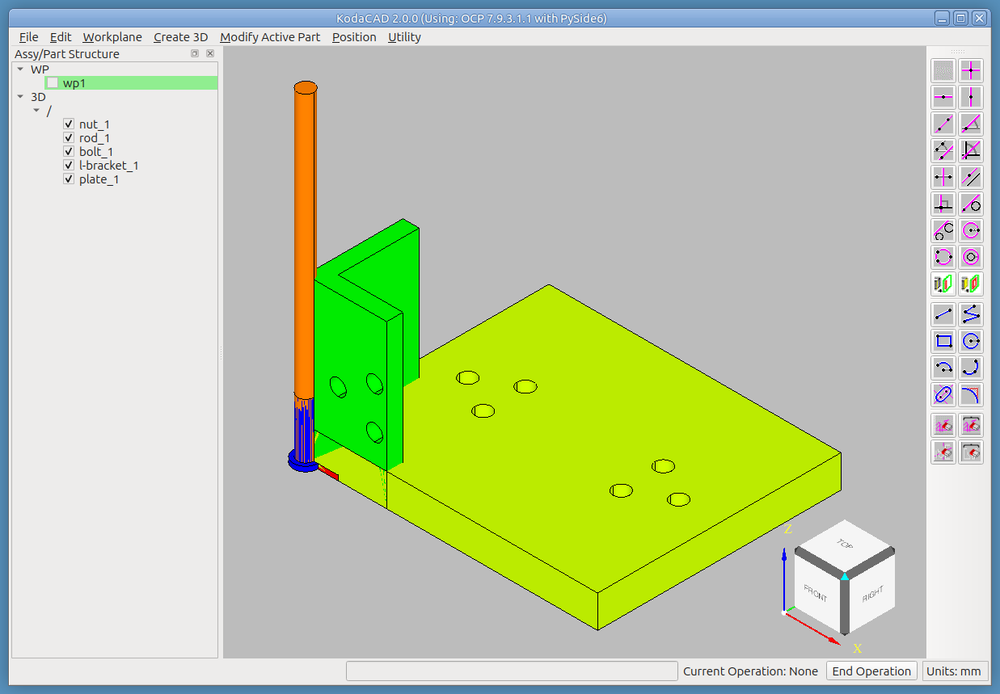
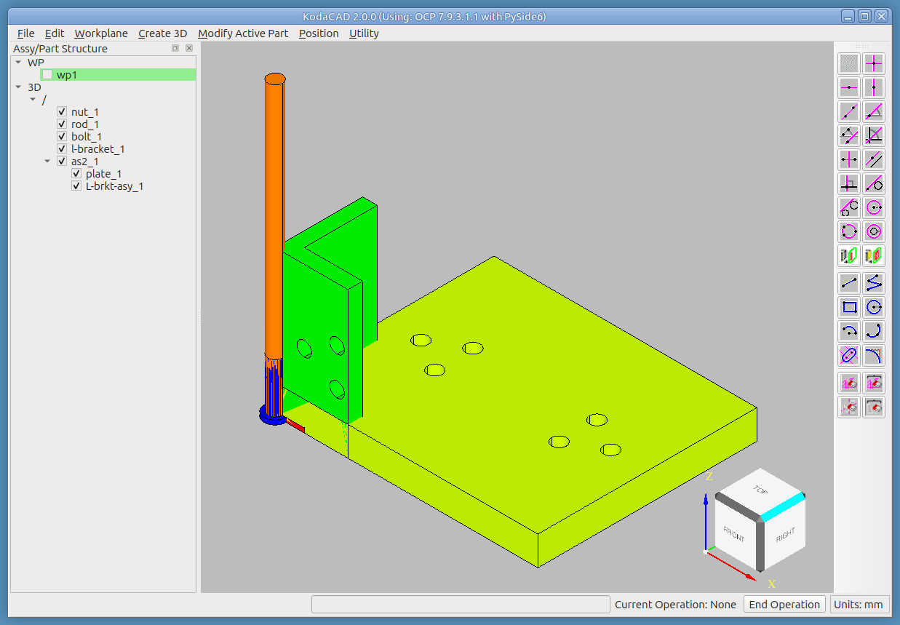
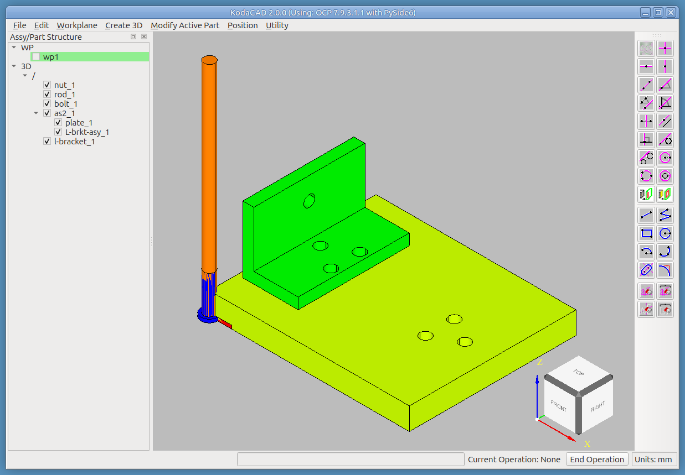
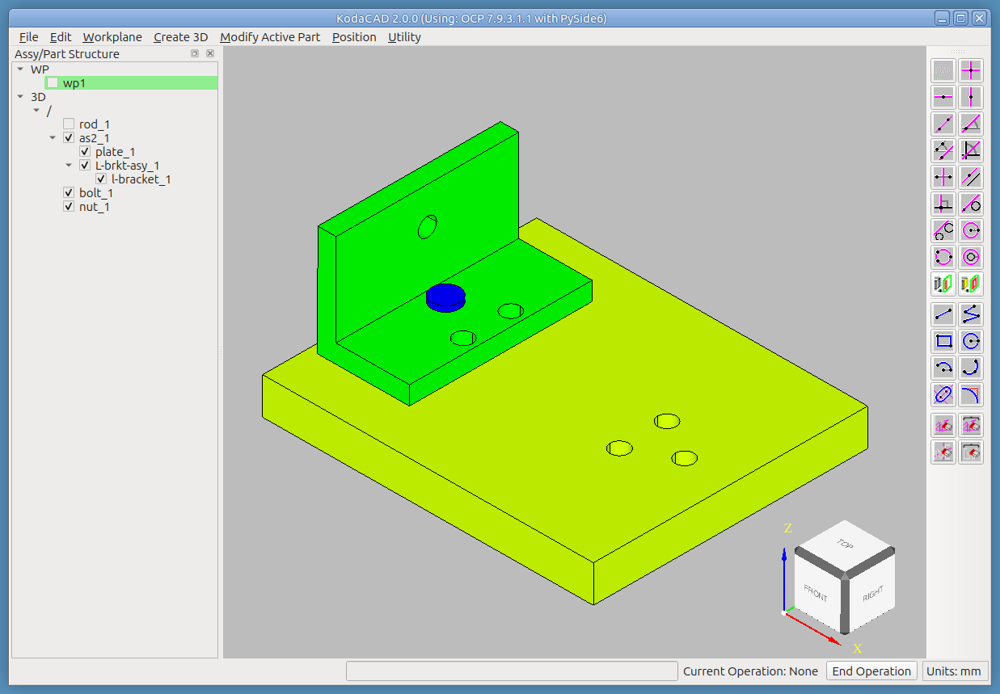
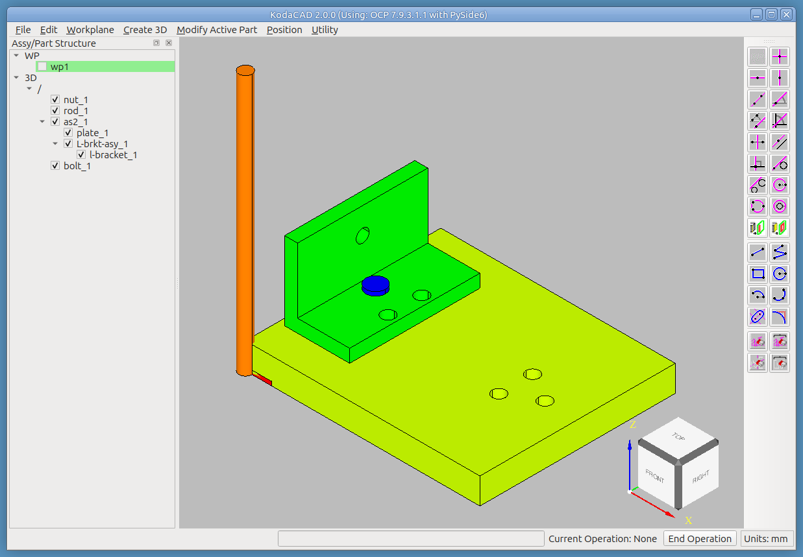
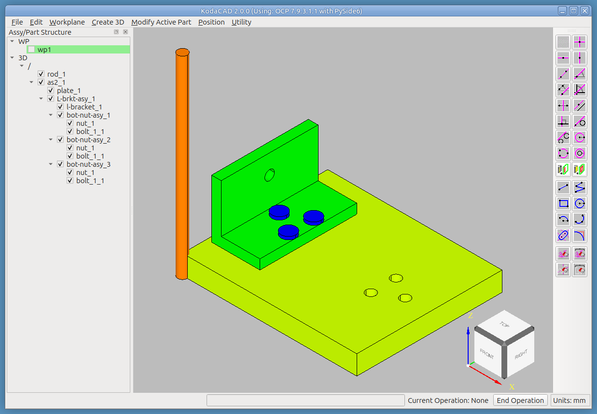
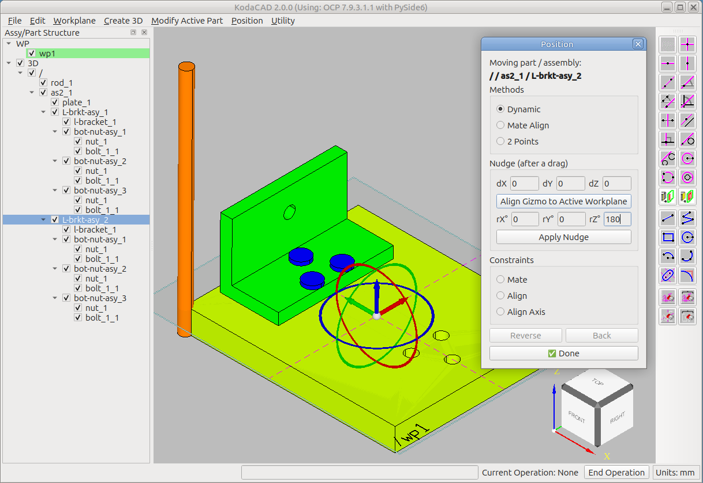
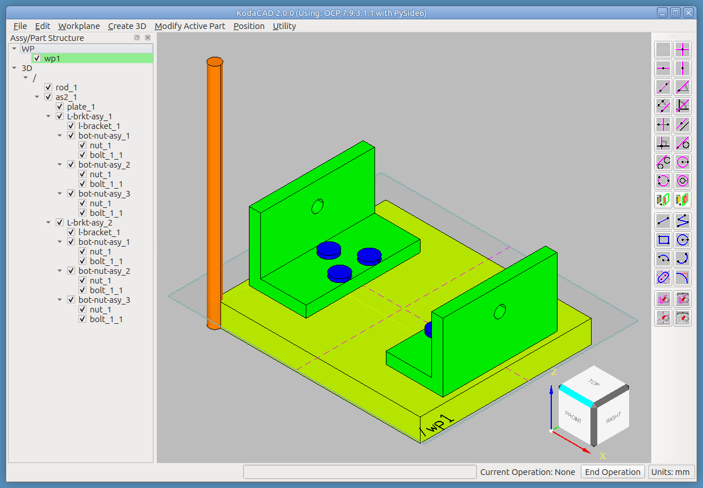
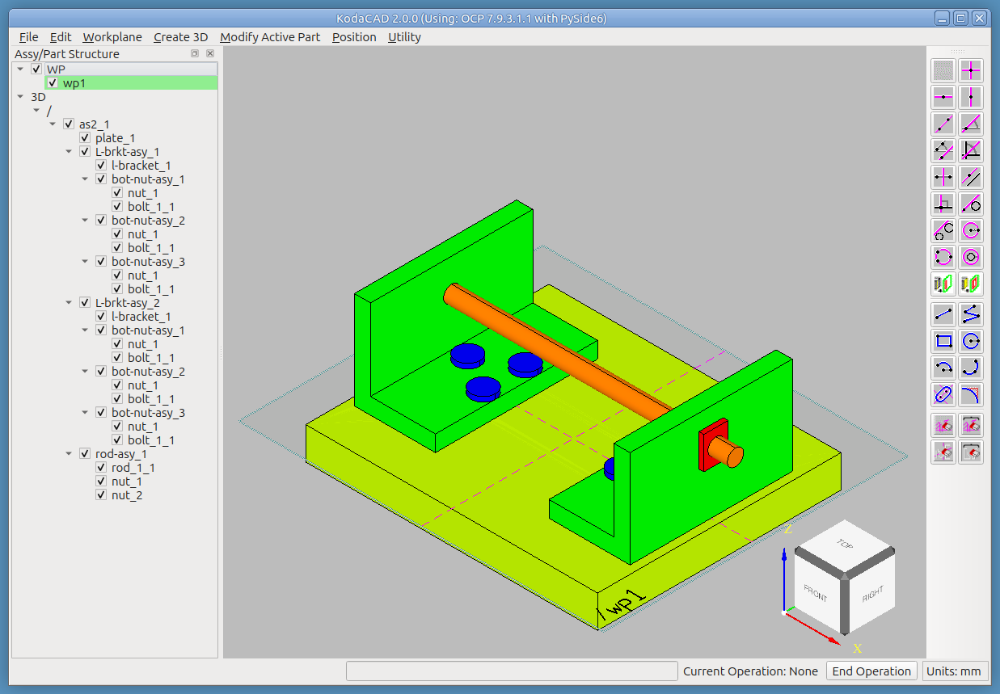

# Tutorial: Build assembly 'as1' from a Kit-of-Parts

In the `as1-oc-214` tutorial, we got an overview of how Kodacad can be used to load and examine a STEP file containing an existing assembly.

In this tutorial, we will see how to actually build the assembly ourself from a kit of parts. The "kit" consists of the 5 root level prototypes that we saw in the as1-oc-214 tutorial, all located in a "pile" at the origin, where they were created.

---

## Step 1 -- Import the file into an empty KodaCAD session

**File -> Import STEP**, choose the file `as1-oc-214-kit-of-parts.stp`

## Step 2 -- Begin creating the assembly tree

* RMB click on '/' and select Create New Assembly. Name the assembly 'as2' (to differentiate it from the original which was named 'as1'
* In the tree. drag the plate into the newly created 'as2' assembly.
* The plate is already positioned in the correct location, so we don't have to move it.
* RMB click on 'as2' and select Create New Assembly. Name the assembly 'L-brkt-asy'. I like to use an upper case 'L', because it's more apparent that the shape of the bracket resembles the shape of the *Letter* 'L'.

## Step 3 -- Add the L-bracket into the assembly and position it.

* Drag and drop the 'l-bracket' (part) into the new 'L-brkt-asy' (in the tree).
* Position the L-brkt on the plate
    * First select it by clicking on it
    * **Position -> Position Selected**
        * In the dialog, choose method **Mate Align**
            1. Choose constraint **Mate**, then select bottom face of bracket then top face of plate.
            2. Choose constraint **Align Axis**, then click on the cylindrical face of one of the holes in the bracket, then the cylindrical face of the corresponding hole in the plate.
            3. The final constraint (which may not be needed) is another **Align**, then click on the back (vertical) side of the bracket and the left side of the plate to insure that they are parallel.

## Step 4 -- Position the bolt & nut

* Hide the rod to make it easier to pick on the bolt
* Position the bolt in one of the holes in the L-bracket
    * Select the bolt in the tree
    * **Position -> Position Selected**
        * In the dialog, choose method **Mate Align**
            1. Choose constraint **Align Axis**, then click on the cylindrical face of the bolt, then on the cylindrical surface of the target hole in the L-bracket.
            2. Choose constraint **Mate** to mate the underside of the bolt head with the top face of the plate.
* Position the nut in 2 stages: First, move it away from the plate to get better access for picking, then put it precisely where it belongs.
    * Select the nut in the tree
    * **Position -> Position Selected**
        * Stage 1: In the dialog, choose method **Dynamic**
            * Use the handles to drag the nut away from the plate a little bit to facilitate picks on the nut.
        * Stage 2: In the dialog, choose method **2 points**
            1. Click the first point: Using the **ctrl+shift** keys, click on the top **edge** of the cylindrical hole in the nut. (Using the **ctrl+shift** keys while picking a circular edge will find the **center** of the circle.)
            2. Click the second point: Using the **ctrl+shift** keys, click on the **edge** of the cylindrical hole in the bottom face of the plate.

## Step 5 -- Create the bolt-nut-asy

* RMB click on 'L-brkt-asy' and select Create New Assembly. Name the assembly 'bolt-nut-asy'.
* In the tree. drag the bolt into the newly created 'bolt-nut-asy' assembly.
* In the tree. drag the nut into the newly created 'bolt-nut-asy' assembly.

## Step 6 -- Create 2 more instances of bolt-nut-asy

* RMB click on 'bolt-nut-asy_1' and select **Create Shared Instance**. Name the new instance 'bolt-nut-asy_2'. This new instance is positioned in exactly the same spot as the original, so the only way you know it's there is to use the Hide/Show buttons on the tree to show them individually.
* Move the new 'bolt-nut-asy_2' to the next hole.
    * With both instances of the bolt-nut-asy hidden, select the new one.
    * **Position -> Position Selected**
        * In the dialog, choose method **2 points**
            * While holding the ctrl+shift keys, pick the circular edge of the hole where the assembly is currently located, then the target hole.

* Repeat the steps above to create 'bolt-nut-asy_3' and position it in the 3rd hole.

## Step 7 -- Create and Position L-brkt-asy_2

* RMB click on 'L-brkt-asy_1' and select **Create Shared Instance**. Name the new instance 'L-brkt-asy_2'.
* We plan to rotate this new assembly 180 degrees about a Z-direction axis through the center of the plate.
    * For that, we will construct a workplane on the top face of the plate.
    * **Workplane -> On Face**, then pick top face of plate, then one of the sides of the plate. This places the origin at the geometric center of the first face picked.
* Now select 'L-brkt-asy_2' in the tree.
* **Position -> Position Selected**
    * In the dialog, choose method **Dynamic**
    * Click the **Align Gizmo to Active Workplane** button
    * Enter 180 in the **rZ** field
    * Click on the **Apply Nudge** button to see the proposed move
        * If not correct, click the **Back** button.
        * If correct, click **Done**.

## Step 8: -- Create the rod-asy

* We will first create the rod-asy and then do the following 2 things. They can be done in either order.
    1. Move the rod to its correct position in the overall assembly
    2. Drag and drop the rod into the rod-asy
* RMB click on 'as2' and select Create New Assembly. Name the assembly 'rod-asy'. In the tree, drag the rod into the new assembly.
* Select the rod in the tree, then **Position -> Position Selected**
    * In the dialog, choose Method **Mate Align**
    * Choose Constraint **Align Axis**
        * Click first on the rod's cylindrical face
        * Next click on the cylindrical face of the target hole of one of the L-brackets.
    * choose Constraint **Align**
        * Click on an end face of the rod
        * click on the corresponding end face of the plate
    * Click on the **Done** button
* You will notice that we aren't really done. The rod extends beyond one L-brkt farther than the other.
* Launch the calculator **Utility -> Calculator** and use the **Dist** button to measure how far the rod needs to move in order to be centered in the X direction.
* Re-enter the Position dialog and nudge the rod in X to center it w/r/t the overall assembly.
* Next, create a shared instance of one of the nuts, and
    1. Reposition it onto the rod using your choice of methods.
    2. Drag it into the rod-asy in the tree.
* Finally, create another shared instance of the nut and reposition it to the opposite end of the rod asy.

