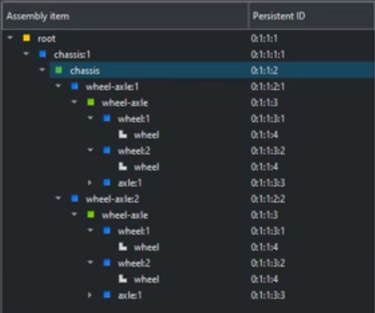
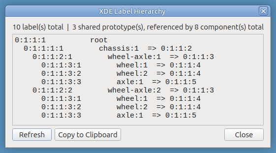
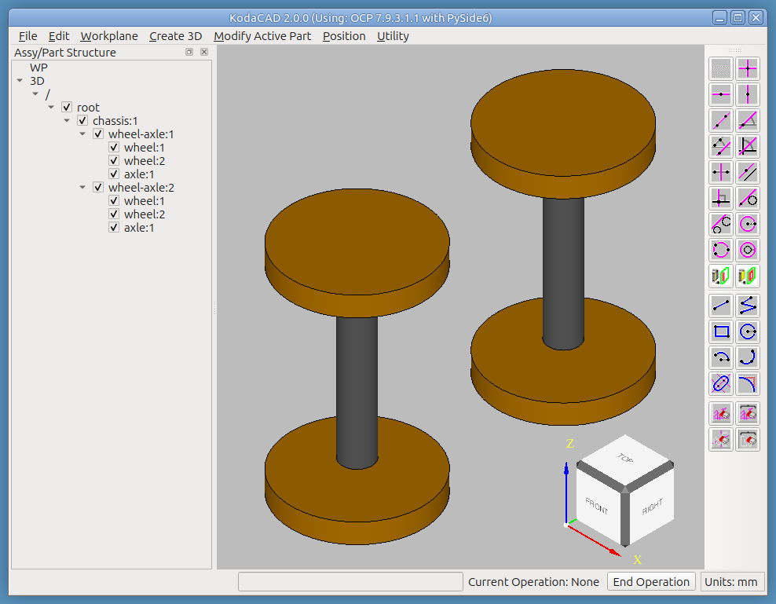
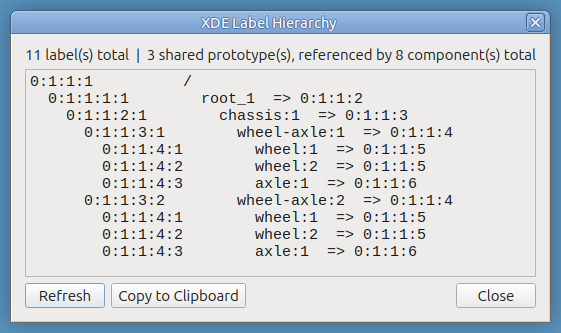
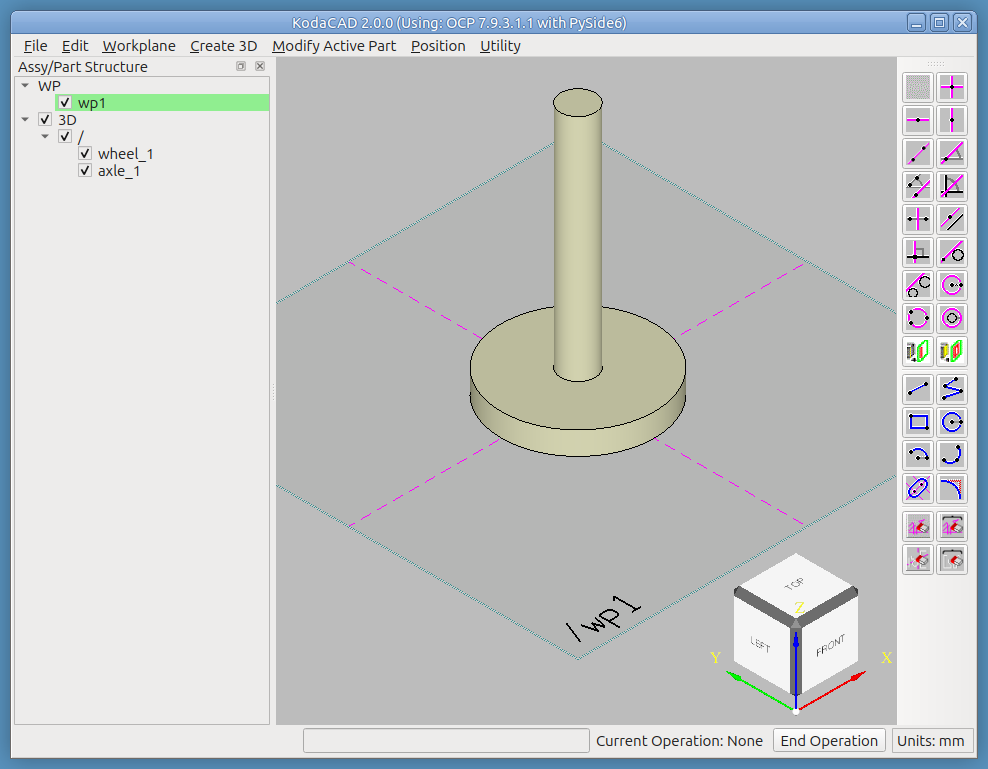
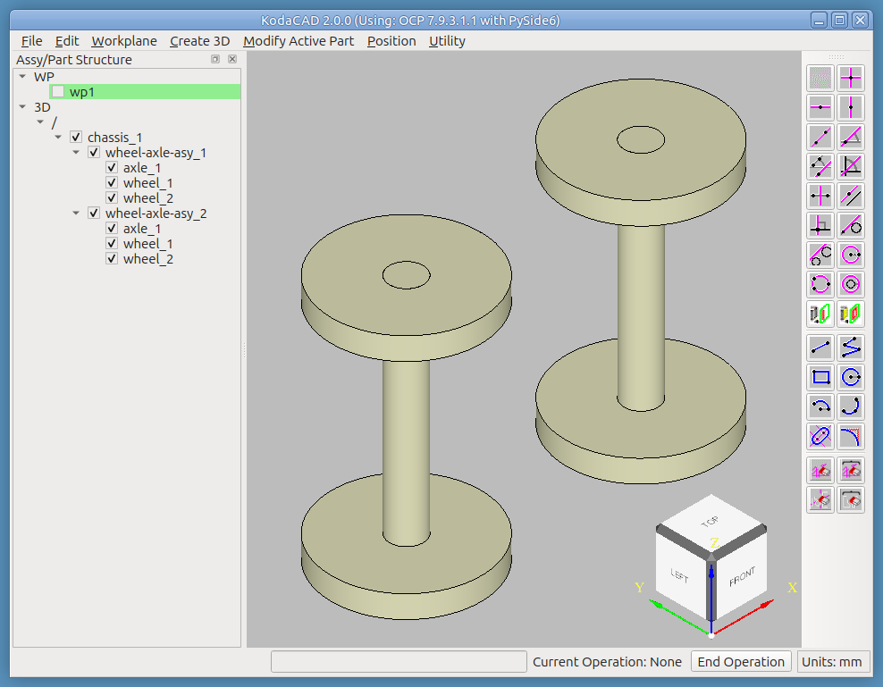
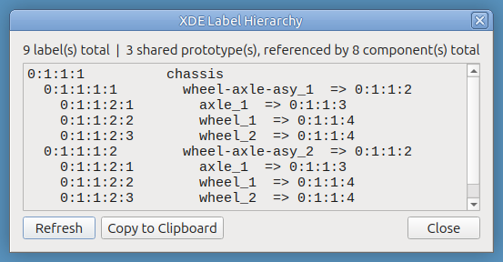
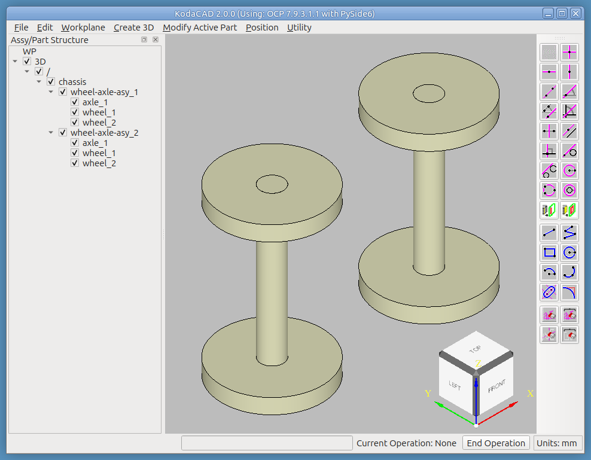

# Tutorial: Building Quaoar's Chassis

This tutorial is based on Lesson 12 of the [Quaoar Workshop Tutorials](https://www.youtube.com/playlist?list=PL_WFkJrQIY2iVVchOPhl77xl432jeNYfQ)
series, in which a simple chassis example (`chassis.step`) is used to
explore how parts, components, instances, prototypes, and
subassemblies are represented in a hierarchical assembly in Open
Cascade.

KodaCAD is built on the Open Cascade kernel, so it makes sense to
benchmark its own ability to construct this chassis exactly. If
`chassis.step` is loaded into KodaCAD as a session, the resulting
assembly hierarchy corresponds exactly to the one shown in Quaoar's
Lesson 12 video.

Quaoar Hierarchical Assembly | Hierarchy (in KodaCAD) | Chassis session displayed in KodaCAD
----------------------------|-------------------------|------------------------------
 |  | 

Alternatively, if the file is imported into an empty KodaCAD session,
the `root` label is brought in as a **child** of `/`, as shown below.

## What you'll need

The `chassis.step` file in this folder, for Step 1. Steps 2 onward
build a wheel-and-axle assembly entirely from scratch in a fresh
KodaCAD session -- no file needed for those.

## What this exercises

Measuring 3D geometry from an imported STEP file with the calculator's
Ctrl+Shift circle-center picking; native part creation via sketching
and Extrude; sibling-assembly creation; drag-reparenting parts into an
assembly; shared-instance creation; most of the Position dialog's
surface (Dynamic, Nudge, Mate Align, 2 Points) for positioning both a
shared part and a shared assembly; STEP save; and Undo/Redo across a
long, mixed chain of native-construction, assembly-structure, and
positioning operations.

---

## Step 1 -- Measure dimensions of the 3D model in the original file `chassis.step`

1. Load `chassis.step` as a session, or import it into an existing
   one.
2. Use the calculator's bottom-row buttons to measure the 3D model.
   * Pick the center of a circle by holding down **Ctrl+Shift**.

Here are the dimensions measured this way:

Part   | Radius (mm) | Axial Length (mm)
-------|-------------|------------------
Axle   | 7.5         | 110
Wheel  | 33.288      | 10

Distance between axles = 105 mm

*Exercises: STEP loading (either path); the calculator's Ctrl+Shift
circle-center picking against real, imported 3D geometry.*

## Step 2 -- Create a wheel and an axle

* Start KodaCAD.
* Create a new workplane, **At Origin** on the XY Plane.
* Click the top face of the ViewCube for a straight-down view filling
  the viewport.
* Use the **Circle** tool to draw a circle at the origin with the
  axle radius.
* Draw a second, concentric circle with the wheel radius.
  * Extrude this to the wheel's length and name it "wheel". (A hole
    for the axle is a deliberate design choice here, not required.)
* Temporarily hide the wheel so only the workplane is displayed.
* Use the **Delete Geometry Element** tool to delete the outer circle.
  * Extrude this to the axle's length and name it "axle".
* Clicking the ViewCube's top-left-front corner gives this view:

*Exercises: workplane creation, concentric circle sketching, hiding a
part mid-workflow, Delete Geometry Element, and two independent
Extrude operations from the same sketch.*

## Step 3 -- Create the assembly structure

* RMB click `/` in the tree and select **Create New Assembly**. Name
  it "wheel-axle-asy".
* Drag "axle" into "wheel-axle-asy" in the tree.
* Drag "wheel" into "wheel-axle-asy" in the tree.
* RMB click "wheel" and select **Create Shared Instance**.
  * Rename it to "wheel_2" via RMB.
* Select the new wheel instance and position it at the opposite end of
  the axle. All three methods work:
  * **Dynamic** -> Nudge 100 mm in Z.
  * **Mate Align** -> Align.
  * **2 Points** -- pick the center of each wheel's rim.
* RMB click `/` and select **Create New Assembly** again. Name it
  "chassis".
* Drag "wheel-axle-asy" into "chassis".
* RMB click "wheel-axle-asy" and select **Create Shared Instance**.
  * Rename it to "wheel-axle-asy_2".
* Select the new assembly instance and position it 105 mm in the X
  direction. (In the original file, the second assembly is moved in
  Y instead -- either works to demonstrate the mechanism.)

*Exercises: creating a new assembly directly at the root `/` in a
fresh session; drag-reparenting parts into an assembly; shared-instance
creation for both a part and an assembly; all three Position dialog
methods (Dynamic/Nudge, Mate Align, 2 Points), including 2-Points
picking a circle's center on a non-analytic (heavily-cylindrical, likely
NurbsConverted) 3D edge.*

## Step 4 -- Save the session

KodaCAD doesn't have its own native save format -- it depends entirely
on saving and loading a session as a STEP file.

*Exercises: STEP save on a from-scratch, multi-level assembly with two
shared instances.*

## Step 5 -- Test Undo / Redo

* Before exiting this session, check how many Undo steps are
  available: **Utility -> Undo/Redo count**. Expect somewhere around
  14.
* Use Undo several times and watch the model step back through earlier
  states.
* Confirm Redo returns the session to the completed state, one step at
  a time.

*Exercises: undo/redo across a long, mixed chain -- native part
creation, assembly-structure changes (which have to create the root
`/` label the very first time), reparenting, shared-instance creation,
and positioning, all in the same undo history.*

## Step 6 -- Reload the saved session

* Undo/Redo history doesn't survive exiting a session.
* Workplane(s) are lost too -- they're pure UI state, never written to
  the OCAF document at all.
* The reloaded 3D model itself is restored 100%.

Hierarchy (in KodaCAD) | Chassis displayed in KodaCAD
-------------------------|------------------------------
 | 

*Exercises: STEP reload fidelity for a from-scratch, multi-level
assembly with shared instances -- confirming the round trip preserves
everything Step 3 built.*

---

## Notes for whoever runs this next

- If any step's status bar message, menu label, or tool name has
  changed since this was written, that's worth fixing here directly --
  this document drifting out of sync with the actual UI is exactly the
  kind of thing it's meant to catch.
- See the [Assembly Structure tutorial](../as1-oc-214/README.md) for
  the two STEP-loading paths explored in more depth, and for fillet
  propagation across a *pre-existing* (rather than freshly-created)
  shared instance.
