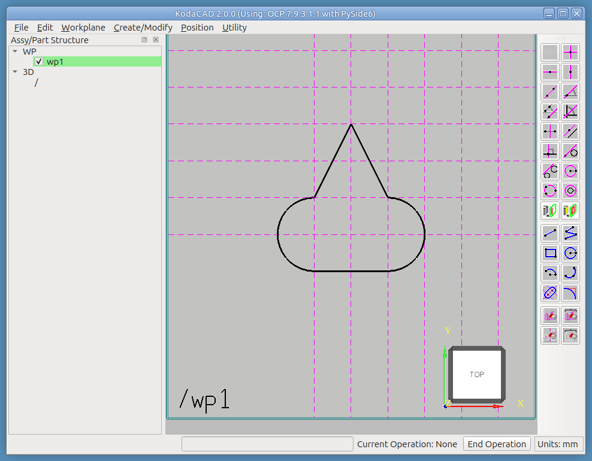

# Tutorial: Sketching a Jack-o'-Lantern with KodaCAD's 2D Tools

This one is primarily about the 2D sketch toolbar -- construction
lines, construction circles, and the geometry tools that turn a
layout into a real profile. We'll draw a jack-o'-lantern face on a
practice workplane, one feature at a time, then -- as a bonus, once
the sketching itself is solid -- use that same face to carve an
actual pumpkin.

## What you'll need

A fresh (empty) KodaCAD session. No file import required -- everything
here is built entirely from scratch.

## What this exercises

Nearly the full 2D sketch toolbar in one continuous drawing: Parallel
Construction Line, Angled Construction Line, Construction Line by 2
Points, Construction Circle, Constr Circle by 3 Points, Slot,
Polyline, Arc by 3 Points, Arc: Center + 2 Points, and both Delete
Construction Element and Delete Geometry Element -- deliberately using
more than one tool to build equivalent geometry (the two eyes), so the
same result is reachable more than one way. The second half builds on
the Bottle tutorial's own pull-then-heavily-fillet technique for a
rounded, non-revolved form, and demonstrates Pull's multi-profile
capability for real -- three separate closed profiles (nose, two eyes,
mouth) all carved into the pumpkin in a single Apply, rather than one
hole at a time.

We'll be drawing with two kinds of lines throughout:
* **Construction lines** -- the dotted magenta lines used to lay out
  the drawing accurately.
* **Geometry lines** -- the heavy, solid lines that make up the
  actual **profiles** used to create or modify 3D shapes.

The goal of every profile below is a simple, closed loop of geometry
lines -- nothing extraneous, no open gaps. Get that right and the CAD
kernel turns it into a **wire**, ready to be pulled. Get
it wrong and the kernel won't accept it.

---

## Step 1 -- Make the nose

This first workplane is just for practice -- feel free to make
mistakes and try out both the construction and geometry tools freely.

* Start a new KodaCAD session and create a workplane at the origin on
  the XY plane. We'll use a 20 mm grid of construction lines
  throughout, to keep the layout accurate without cluttering it with
  dimensions.
* Click the **Parallel Construction Line** tool, enter `20`, then
  click the vertical construction line, move the cursor to one side,
  and click to place a second vertical line 20 mm away. Repeat on the
  other side of the original line.
* Use the **Slot** tool to click the two intersection points to the
  left and right of the origin, then enter a slot width of `40`.

* Add some more grid lines above and to the right of the slot.
* Finish the nose with the **Polyline** tool: two diagonal lines
  meeting at a point above the slot, as shown below. Then use
  **Delete Geometry Element** to remove the slot's own upper straight
  edge, since the two new diagonals replace it.

*Exercises: Parallel Construction Line for a symmetric grid; Slot;
Polyline; Delete Geometry Element -- and, implicitly, that a profile
can be assembled from more than one tool's own geometry (the slot's
two remaining sides plus the polyline's two new ones) as long as the
final loop closes cleanly.*

## Step 2 -- Make the eyes

* Use **Construction Line by 2 Points** to add a 45-degree angled
  construction line, and **Construction Circle** to add a circle
  above and to the right of the nose -- this is the left eye's
  location.

* Using the same Construction Circle tool, add a second circle. Click
  first at the intersection of the first circle and the 45-degree
  line to set its center, then click again at the intersection of the
  first circle and either the horizontal or vertical construction
  line through its own center.

* Use **Arc by 3 Points** to place the two arcs shown below. For each
  arc, click the two end points first, then a point where the arc
  crosses the 45-degree construction line.

* Repeat all of this for the right eye, but try different tools this
  time, to see that the same shape is reachable more than one way:
  * **Angled Construction Line** instead of Construction Line by 2
    Points, for the 45-degree line.
  * **Constr Circle by 3 Points** instead of Construction Circle, for
    the first circle.
  * **Arc: Center + 2 Points** instead of Arc by 3 Points, for the two
    arcs. This one takes a little practice -- after clicking the
    center, the two end points have to be clicked in CCW order (the
    standard positive direction for measuring arcs). If a click goes
    wrong, **Delete Geometry Element** removes just the mistake,
    without disturbing anything else.

> Mistakes on the workplane itself are best undone with **Delete
> Construction Element** or **Delete Geometry Element**, picking off
> just the one line that's wrong. The Edit menu's Undo/Redo are for
> undoing changes to the 3D model, not individual sketch lines.

*Exercises: two complete, independent tool paths for equivalent
geometry -- Construction Line by 2 Points + Construction Circle + Arc
by 3 Points for the left eye, versus Angled Construction Line + Constr
Circle by 3 Points + Arc: Center + 2 Points for the right -- plus
Delete Construction Element and Delete Geometry Element for
correcting mistakes along the way.*

## Step 3 -- Make the mouth

* Expand the grid below the nose in preparation for the mouth.
* Use **Polyline** to click through every point of the mouth in
  sequence.

*Exercises: Polyline for a longer, more irregular closed profile than
the nose's simpler one.*

---

## Building the pumpkin

The face is done. From here, we build an actual pumpkin and carve
this same face into it.

## Step 4 -- Pull a square profile

* Create a new workplane at the origin, on the XY plane.
* Create a square profile centered on the origin
    * Use the **Rectangle** tool to sketch a 300 mm square
        *Eenter `-150, -150`, then `150, 150`.

* RMB click on '/' and select **Create Empty Part**, name it 'pumpkin'.
* Pull the profile: **Create/Modify -> Pull**
    * Operation: Add Material
    * Mode: Linear
    * Direction: +W
    * Distance: 380
    * Click Done
* Pumpkin has taken the form of a large block and has been set **Active**.

* Hide (or delete) the workplane -- it's no longer needed, and its
  own lines could interfere with picking edges in the next step.
* Pumpkin should still be active.
* Fillet all of its edges: **Create/Modify -> Fillet**
    * Select all 12 edges
    * Enter radius value: 130

*Exercises: Rectangle-based pull into a simple box, then a large fillet
operation turns that box into a rounded, pumpkin-like solid.*

## Step 5 -- Shell the pumpkin

* **Modify Active Part -> Shell**: click the small square top face,
  enter `20` for the shell thickness.

Worth knowing going in: that top face is entirely bounded by tangent
fillets rather than genuine sharp edges shared with other faces, so
Shell has no real opening to carve there -- the result comes out
completely closed, not open at the top the way Shell normally
produces. That's expected, not a bug: it's a known OCCT limitation
around tangent (not sharp) face boundaries, confirmed independently
in this project against both this pumpkin shape and a plain filleted
bottle. It's also not a problem for this particular build, since the
face will be cut through entirely in the next step regardless.

*Exercises: Shell on a form whose only candidate open face is entirely
tangent-bounded -- a deliberate, known limitation to work around
rather than something the operation should be expected to succeed at
here.*

## Step 6 -- Sketch the face on the pumpkin itself

* **Workplane -> On Face**: click the front rectangular face (the
  workplane's own origin lands at that face's geometric center), then
  the right rectangular face for the +U direction.
* Rebuild the face profiles from Steps 1-3 on this new workplane,
  starting with the nose's slot centered on the workplane's own
  origin.

*Exercises: Workplane -> On Face as the anchor for a second full
sketch pass, and reusing everything from Steps 1-3 in a real,
practical context rather than just as a standalone practice exercise.*

## Step 7 -- Cut the face into the pumpkin

* Confirm the pumpkin part is set active in the tree, and that the workplane
  holding the face profiles is the active workplane.
* **Create/Modify -> Pull**
  * Operation: **Remove Material**
  * Mode: Linear
  * Direction: **-W**
  * Distance: 150
  * Click **✅ Done**
* Hide (or delete) the workplane.

*Exercises: Pull's multi-profile capability for real -- four
separate closed profiles (the nose, both eyes, the mouth) all cut
into the pumpkin in a single Apply, rather than one hole at a time.*

---

## Notes for whoever runs this next

- If any menu label, dialog control name, or button text has drifted
  from what's written here, that's worth fixing in this document
  directly -- catching that drift is exactly what this tutorial is
  for.
- See the [OCC Bottle tutorial](../occ-bottle/README.md) for the
  pull-then-fillet technique this tutorial's own pumpkin
  body is built on, and for Pull's single-profile use as a point
  of comparison against this tutorial's multi-profile one.
