# Tutorial: Using the 2D Tools to make a Jack-O-Lantern face

Like all the tutorials, this one does double duty, not only as a tutorial, but also as a regression test to make sure that as new capabilities and features are added to KodaCAD, all the things that already work continue to do so. If something doesn't work as advertised, please let me know. I greatly value your feedback. If something is broken and I don't know about it, I can't fix it.

This tutorial is primarily about using the 2D tools for drawing on a workplane. First, I wiil go through the steps to draw a Jack-O-Lantern face on a workplane. We will go through each step one at a time. Then, we will see how to use a workplane to actually *carve a pumpkin*.

## Making a practice workplane

* We will be drawing with 2 types of lines.
    * **Construction Lines**: the dotted magenta colored lines which are used to construct our accurate layout.
    * **Geometry Lines**: the heavy, bold lines that comprise the **profiles** used to create and modify our 3D part shapes.

> This first workplane is just for practice. Feel free to make lots of mistakes and just try out all the tools for making (and deleting) both types of lines.

### Step 1 -- Make the Nose

* To begin, start a new Kodacad session and create a workplane at the origin on the XY plane. We are going to use a 20 mm grid of construction lines for this exercise. By using the grid, we will avoid the clutter of dimensions.
* Click on the **Parallel Construction Line** tool, then enter a value of 20. then click on the vertical construction line, and then move the cursor to one side and click to place a 2nd vertical construction line, 20 mm away from the 1st one. Do this again on the other side of the original line.
* The first thing we will draw is the Nose. Use the **Slot** tool to click on the 2 intersection points to the right and left of the origin then enter the slot witdth value 40.

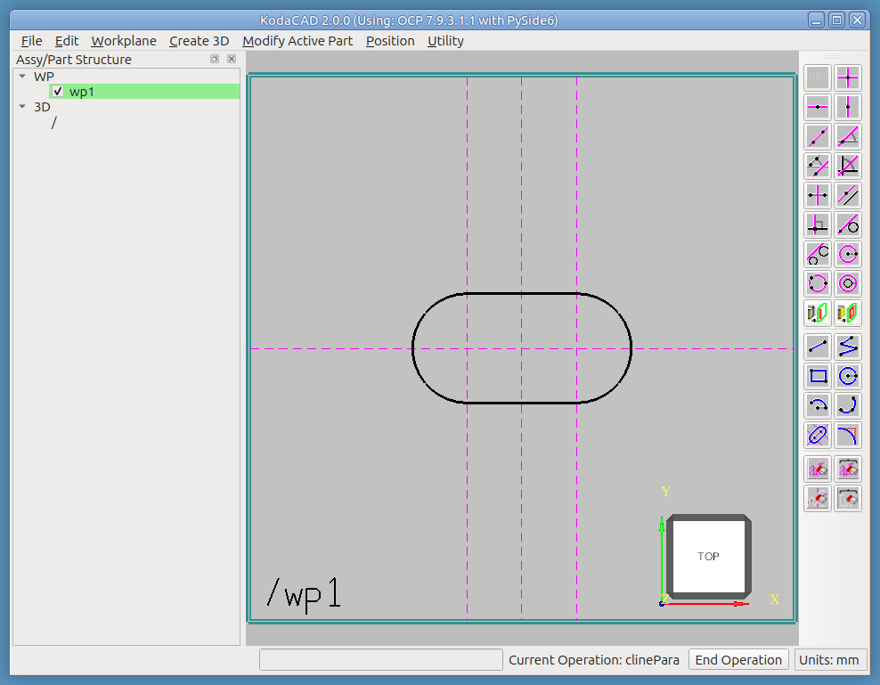

* Add some more grid lines above and to the right of the slot just drawn.
* Finish the nose by using the **Polyline** tool to add 2 diagonal lines as shown below. Use the **Delete Geometry Element** tool to delete the upper straight horizontal line part of the slot.

> Our goal is to create a simple, closed **profile** of geometry lines with nothing extraneous and no open gaps. If we do it correctly, the CAD kernel will be able to convert this profile into a **wire** which can then be used to create (or modify) 3D geometric shapes. If we botch it, the kernel won't accept it, and we don't want that.

### Step 2 -- Make the Eyes

* Next, use the **Construction Line by 2 Points** tool to add a 45 degree angled construction line as shown below. Also use the **Construction Circle** tool to add a construction circle above and to the right of the nose. This is the location of our Jack-O-Lantern's left eye.

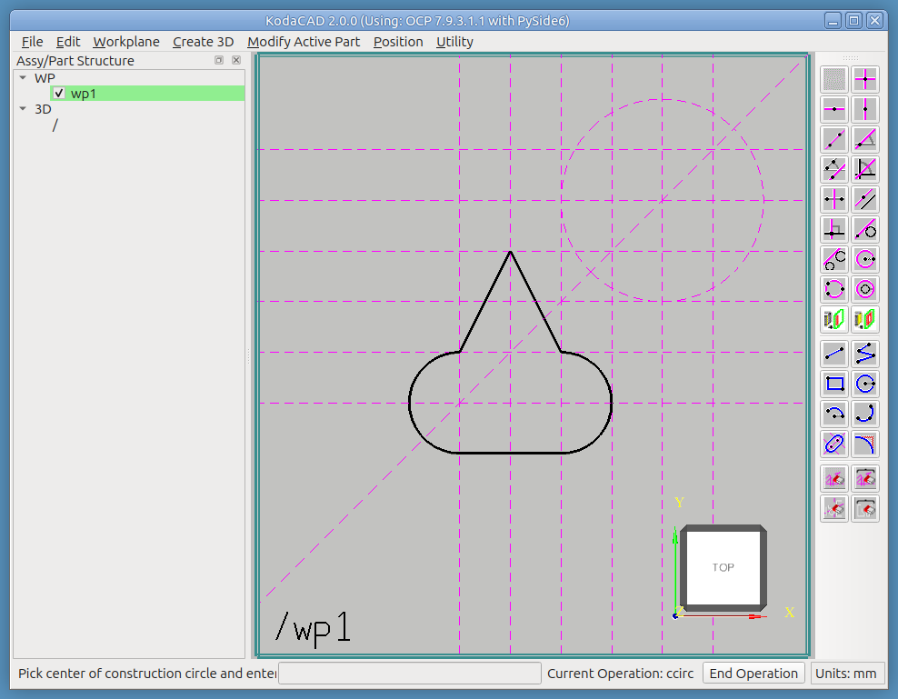

* Using the same tool, add a second construction circle. Click first at the intrsection of the first circle and the 45-degree construction line to set its center. Click again on the intersection of the first circle and either the horizontal or vertical construction lines through the first circle's center.

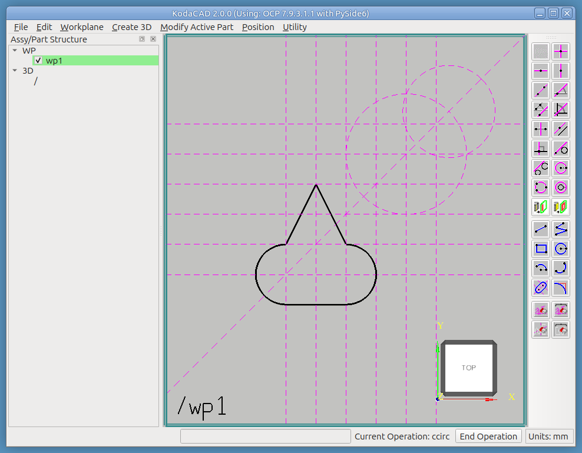

* Now use the **Arc by 3 Points** tool to place the 2 arcs shown below. With each arc, click the 2 end points first, then the point where the arc and circle interesect.

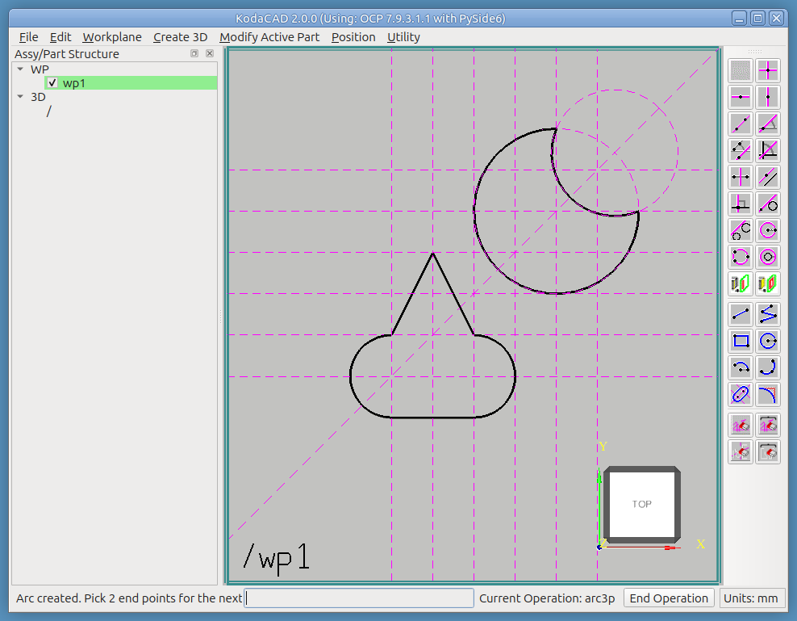

* Repeat all this for the right eye. Try using different tools.
    * Try using the **Angled Construction Line** tool to add a 45 degree angled construction line.
    * Try using the **Constr Circle by 3 Points** tool this time to place the first construction circle.
    * Try crateing the 2 arcs by using the **Arc: Center + 2 POints** tool. This may take some practice. After clicking the center, the order of the 2 end points has to proceed in the CCW direction (the standard positive direction for measureing arcs). If you make a mistake, use the **Delete Geometry Element** tool to delete the mistake and try again.
    
> When you need to Undo a mistake on the workplanes, you can delete indivdual lines using either the **Delete Construction Element** tool or the **Delete Geometry Element** tool. The Undo / Redo functions in the Edit Menu are used to Undo and Redo changes made in the 3D model.

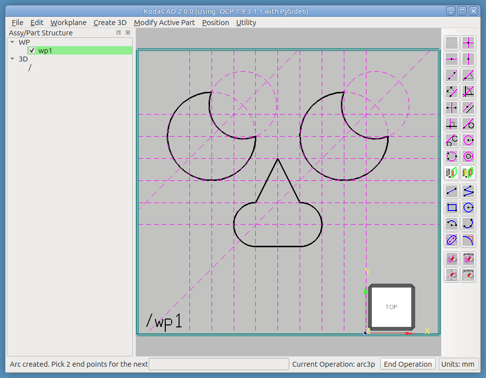

### Step 3 -- Make the Mouth

* Expand the grid below the nose in preparation to make the mouth
* Use the **Polyline** tool to click sequneetially on all the points of the mouth.

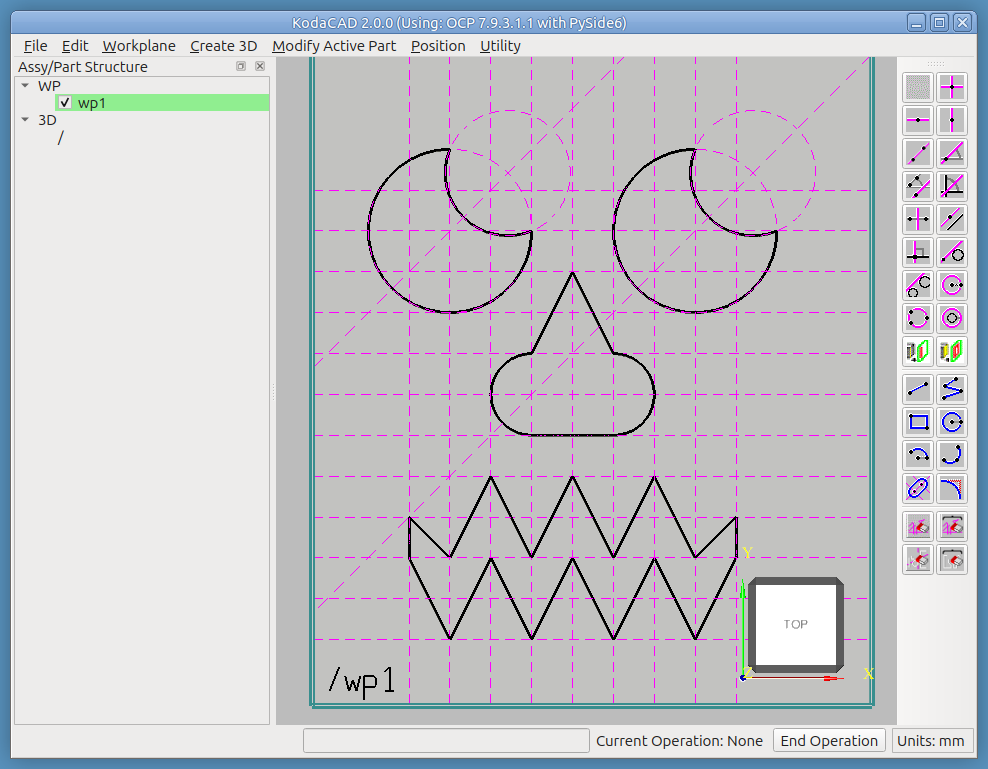

## Build the pumpkin

### Create a Square profile

* Create new workplane at the origin in the XY plane
* Use the **Rectangle** tool to make a square 300 mm on a side, centered at the origin.
* Enter `-150, -150`, then enter `150, 150`

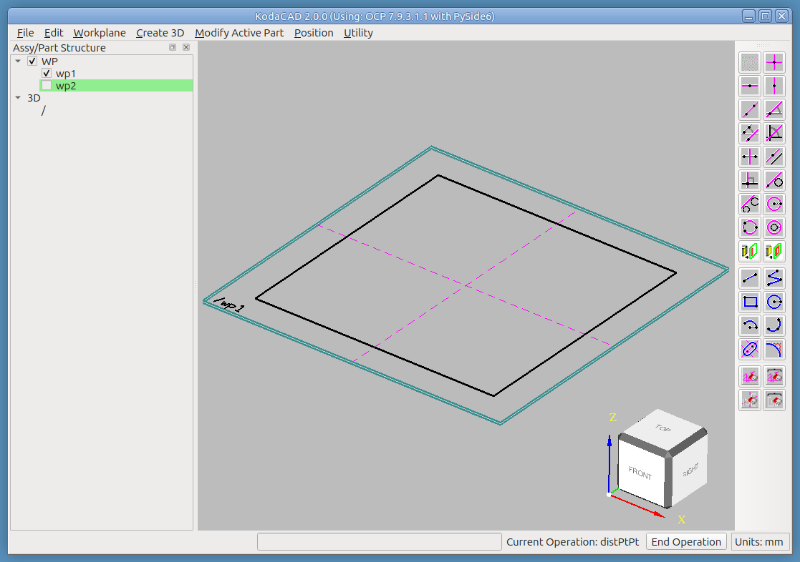

### Extrude the profile

* **Create 3D -> Extrude**
* Enter extrusion length -> 380
* Enter name -> jack

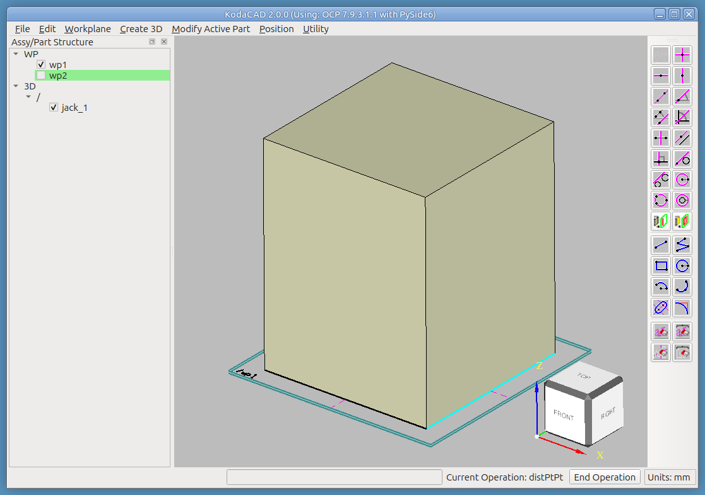

### Fillet the edges

* RMB click 'Jack_1' in tree and select **Set Active**
* Hide (or delete) the workplane (for 2 reasons)
    1. We really don't need it anymore
    2. We will be clicking on the edges of the new solid and the lines of the workplane may interfere with that.
* **Modify Active Part -> Fillet**
    * Select all 12 edges
    * Enter 130 (fillet radius)

### Shell the Pumpkin

> Because the small square face on the top is completely bounded by tangent fillets (instead of edges shared with other faces), selecting it as the open face for the shell operation has the result of producing a shape with no openings. The shell operation has no way of opening that face, so the resutling shelled shape is completely closed, which is not a problem for our pumpkin shape.

* **Modify Active Part -> Shell**
    * Click the 40 mm square top face of the pumpkin
    * Enter the value 20 for shell thickness

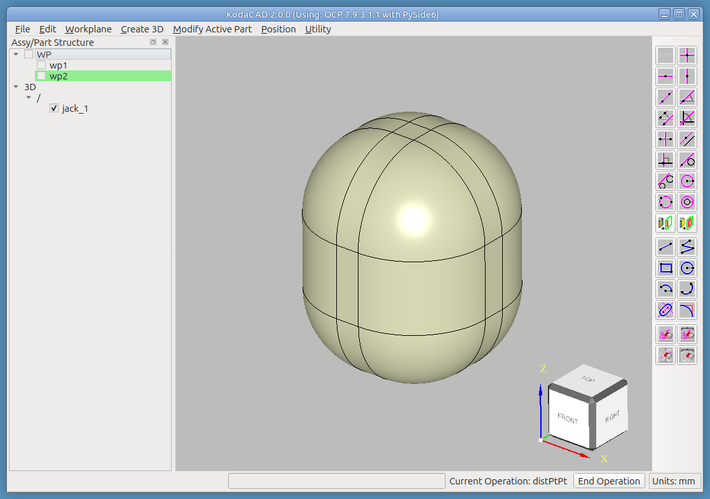

### Create the Face Profiles

* **Workplane -> On Face**
* Click on Front Rectangular face (Workplane origin will be located at the geometric center of face.)
* Click on Right Rectangular face to set +U direction
* Build the 2D face profiles as described in the steps 1-3. Start by placing the center of the slot (nose) at the workplane origin.

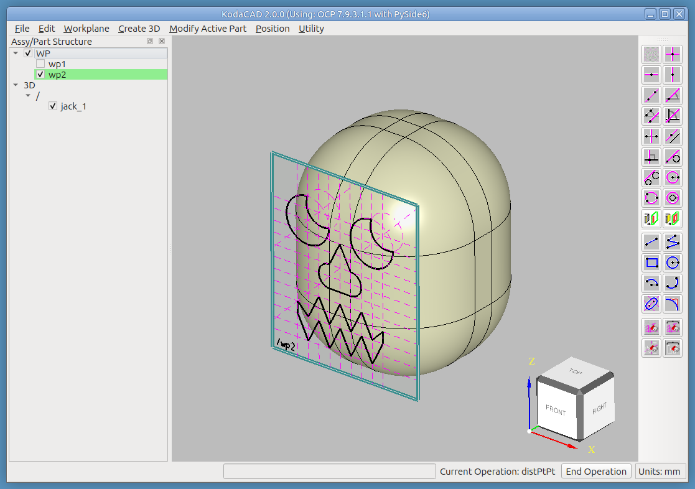

### Mill the Face Profiles

* Make sure jack_1 is set active in the tree
* Make sure the workplane containing the face profiles is set active
* **Modify Active Part -> Mill/Pull**
    * Operation: **Mill**
    * Direction: -W
    * Distance: 150
    * Click Done
* Hide (or delete) the workplane 

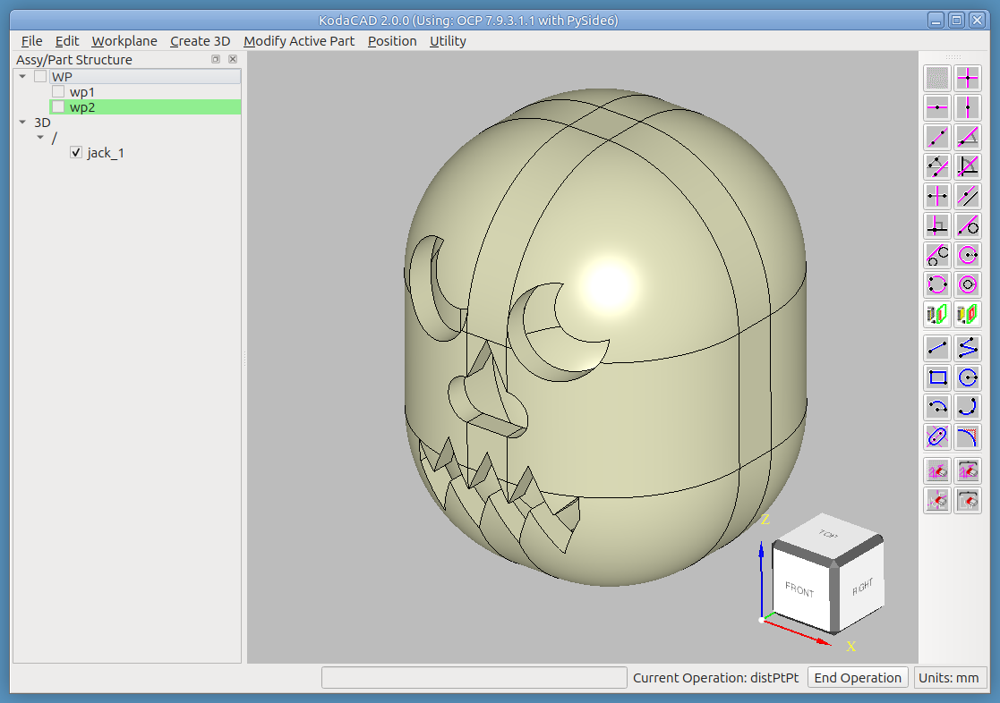

