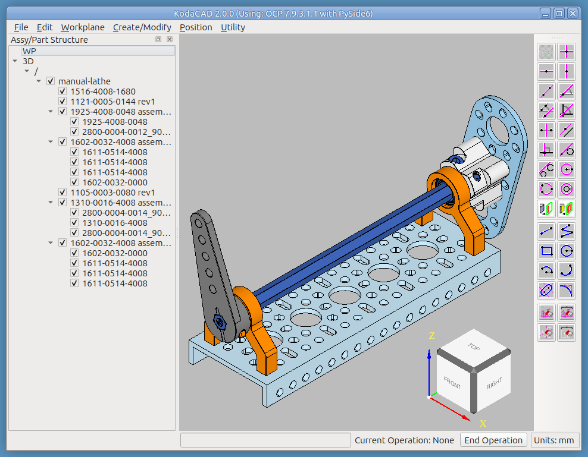
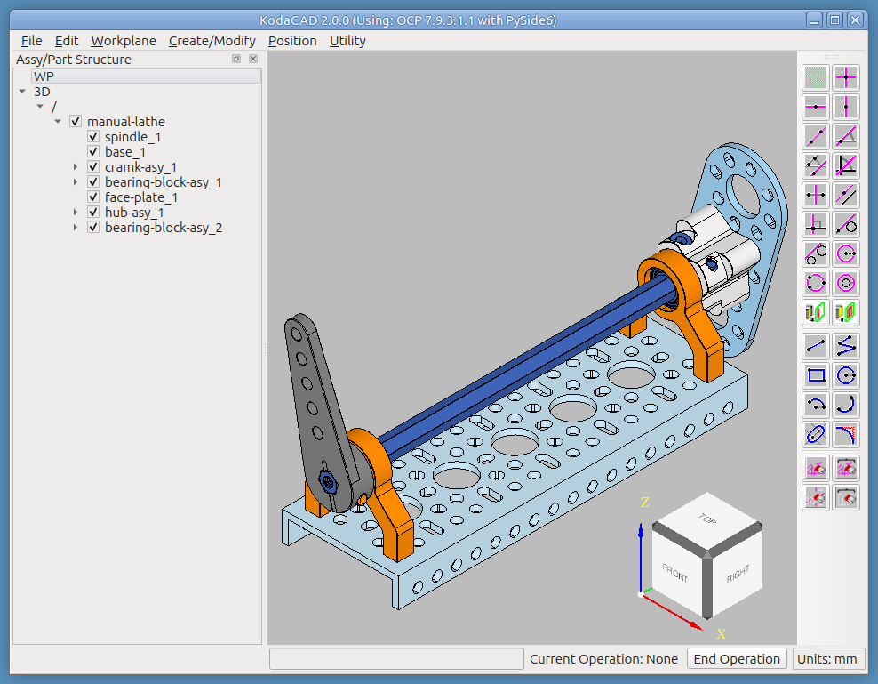
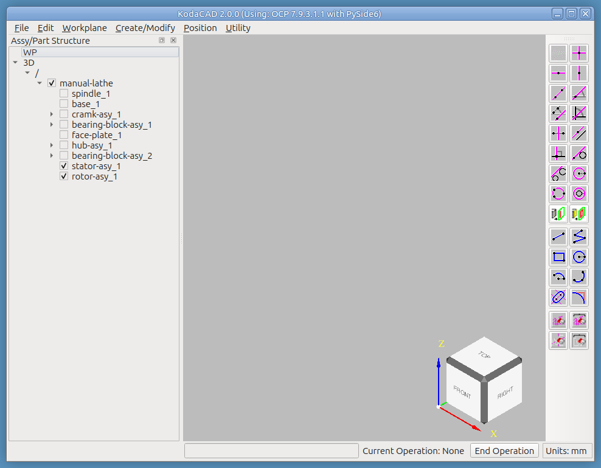
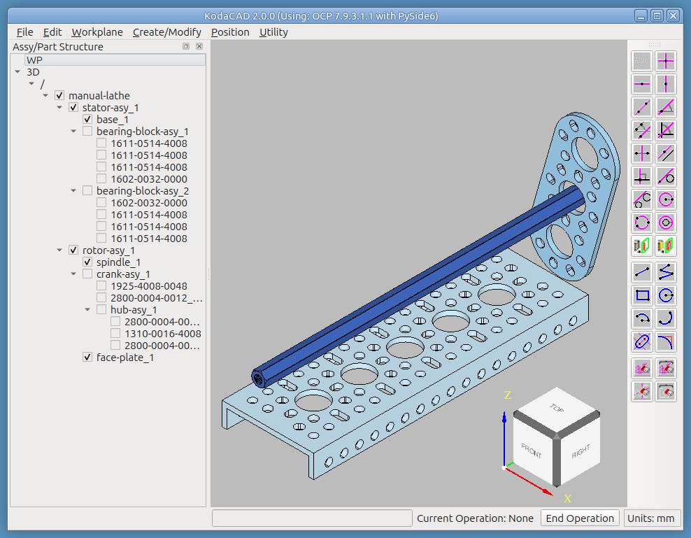
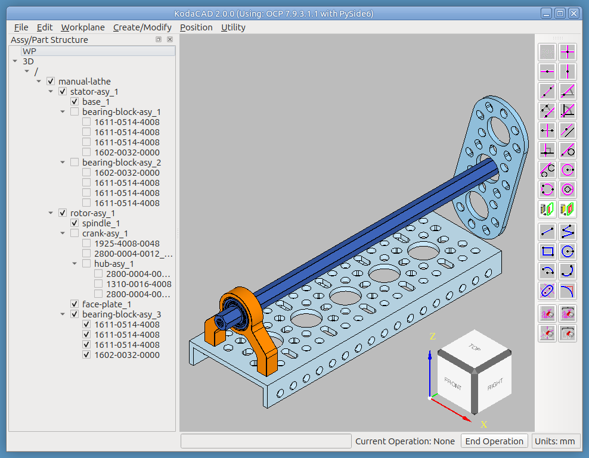
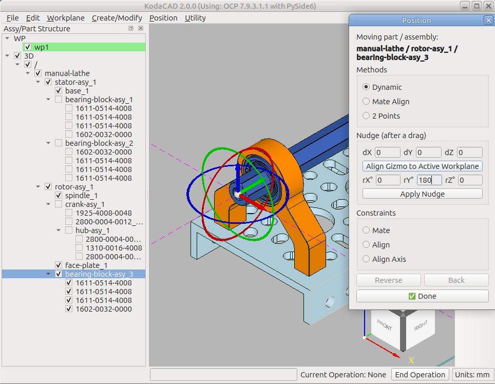
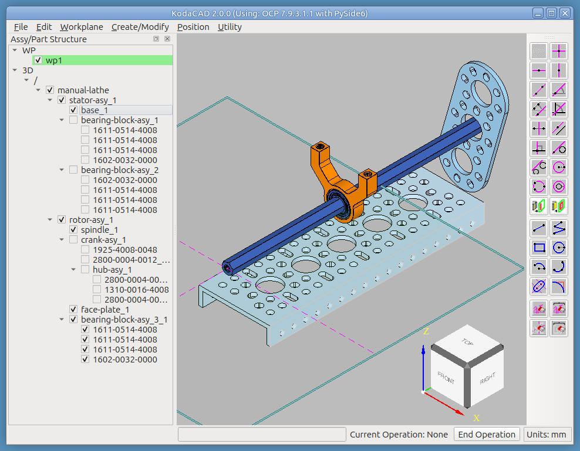

# Tutorial: Organizing and Navigating a Large Assembly (`manual-lathe.step`)

The other assembly tutorials build or explore structure. This one is
about *living with* an assembly that's already gotten big and messy --
the file was built by importing several parts and assemblies found at
the goBILDA website and arranging them into an apparatus that
functions like the headstock of a lathe, driven by hand using a crank
(if you use your imagination, you can spot a spindle supported on two
bearings, a face plate on the right, and a crank arm on the left).
Everything in it arrived with generic, imported part names, and no
organizational structure at all -- exactly the situation that makes a
big assembly hard to navigate, and exactly what this tutorial walks
through fixing.

## What you'll need

`manual-lathe.step`, in this folder.

## What this exercises

Renaming imported parts to something functionally meaningful;
creating sibling assemblies for organization, and the real,
by-design interaction between bottom-up checkbox derivation and
hiding a parent while working under it; drag-reparenting both parts
and assemblies into their new organizational homes, including how
expand/collapse state does and doesn't survive a structural move;
creating a shared instance of an assembly and reparenting it to a
*different* parent than the original (not just placing a fresh
instance for the first time); Workplane -> Point & Direction, used to
anchor a workplane's own origin to a specific piece of 3D geometry
(a circular edge's own center point) rather than a face; and Dynamic
positioning combined with Align Gizmo to Active Workplane for a
rotation about that anchored axis -- Y this time, not the more usual
W, as a reminder the choice isn't fixed to any one axis.

---

## Step 1 -- Load the file

**File -> Load Session**, choose `manual-lathe.step`.

Looking at the tree, the parts and assemblies all have the generic
names they arrived with on import -- not very descriptive of what
anything actually is.

*Exercises: Load Session on a file with real, non-trivial imported
structure.*

## Step 2 -- Assign more descriptive names

Rename each child of the top assembly to something functionally
descriptive (RMB -> Rename), so the tree actually communicates what
it contains.

*Exercises: Rename, applied deliberately to every top-level child at
once as a real workflow step -- not just a single, isolated rename.*

## Step 3 -- Create two subassemblies under the top assembly

Certain operations redraw the viewport, so the fewer parts currently
displayed, the faster those operations complete. Grouping related
parts into subassemblies -- and hiding whichever one isn't currently
being worked on -- keeps things responsive as the model grows.

1. Collapse the top assembly's children in the tree. This collapsed
   state should persist for the rest of the session.
2. RMB click the top assembly and select **Create New Assembly**.
   Name it `stator-asy`.
   * Notice how long this takes to complete.
   * Uncheck the top assembly to hide it, then continue.
3. RMB click the top assembly again and select **Create New
   Assembly**. Name it `rotor-asy`.
   * This one completes noticeably faster -- with the top assembly
     hidden, there's far less to redraw.

The two new assemblies appear as siblings under the top assembly. The
collapsed state from step 1 persists, as expected. But the checkbox
state does something worth understanding rather than just noticing:
the tree now shows `rotor-asy` checked (new assemblies start checked
by default), which correctly re-derives the top assembly back to
checked too, since it now has a checked child. `stator-asy` **also**
shows checked at this point, even though nothing was done to it
directly -- and this is correct, not a bug. Hiding the top assembly
earlier never actually changed `stator-asy`'s own checkbox state; it
only suppressed *display* of everything underneath while the top
assembly itself was hidden. `stator-asy` was checked the entire time,
underneath that suppression. The moment the top assembly gets
re-derived back to checked, every child's own unchanged state --
`stator-asy`'s included -- becomes visible again.

*Exercises: sibling-assembly creation; the real interaction between
bottom-up checkbox derivation and hiding a parent -- a child's own
checkbox state is independent of its parent's, and persists,
unchanged, underneath whatever visibility state the parent happens
to be in.*

## Step 4 -- Drag and drop components into `rotor-asy` or `stator-asy`

Uncheck the top assembly to hide everything, then drag each of the
original child components into whichever of the two new assemblies
fits it.

Watch the tree carefully while doing this -- a few things happen that
are worth understanding rather than being surprised by:

* As soon as the first item lands in `rotor-asy`, `stator-asy` shows
  as checked again -- **the same mechanism as Step 3**: `rotor-asy`
  getting a checked child re-derives its own state to checked, which
  re-derives the top assembly to checked too, which reveals every
  other child's own unchanged state, `stator-asy`'s included.
* Dropping a **part** (not an assembly) makes it visible in the
  viewport immediately, even with everything nominally hidden -- the
  same mechanism again: the part's own checkbox state was already
  checked before the move (nothing about dragging it un-checks it),
  and once its new parent becomes visible via the same cascade, the
  part becomes visible too.
* Dropping an **assembly** (like a bearing-block instance) behaves
  differently in one specific way: it stays hidden as expected, but
  it shows up already **expanded** in the tree, even if it was
  collapsed before the move. This one has a different, genuine cause:
  reparenting assigns the moved item (and its own children) new
  internal identifiers, and a never-before-seen identifier defaults
  to expanded. Collapsing it again after the move fixes it for the
  rest of the session -- this is a minor, honest limitation of how
  expand state is tracked across a structural move, not something
  that needs a workaround beyond re-collapsing once.

Now, to set up Step 5: RMB click `bearing-block-asy_1` and select
**Create Shared Instance**. Name it `bearing-block-asy_3`, then drag
it (in the tree) from `stator-asy` into `rotor-asy`.

*Exercises: drag-reparenting both parts and assemblies; the same
checkbox-cascade mechanism as Step 3, now triggered by drag-and-drop
rather than assembly creation; expand state's real limitation across
a structural move; creating a shared instance and immediately
reparenting it to a *different* parent than the one it was created
under -- not just placing a fresh instance for the first time, which
is the scenario the Chassis tutorial's own shared-instance step
covers instead.*

## Step 5 -- Reposition the new `bearing-block-asy_3`

The new instance needs a 180-degree rotation about the spindle's own
axis, then a move to the center of the assembly.

Rotating about the spindle's axis needs a workplane whose own axis is
anchored to it -- **Workplane -> Point & Direction**: hold Ctrl+Shift
and click a circular arc on the end of the spindle (this sets the
workplane's origin to that arc's own center point), then click the
top face of the base for the +W direction, then a side face of the
base for the +U direction. The resulting workplane's own Y axis is
now colinear with the spindle's axis.

Select `bearing-block-asy_3`, then **Position -> Position Selected**.

* Choose method **Dynamic**.
* Click **Align Gizmo to Active Workplane** -- the gizmo gets
  relocated from its default location to the origin of the active
  workplane.
* Enter `180` in the **rY** field, then **Apply Nudge** to preview the
  rotation.
* If it looks wrong, **Back** and try again; if it looks right,
  continue.

After the nudge, the manipulator resets to its default position and
orientation. Use one of its handles to move the part in Y, toward the
center of the assembly, then click **Done** to commit.

*Exercises: Workplane -> Point & Direction, anchoring a workplane's
own origin to a piece of 3D geometry (a circular edge's own center
point) rather than a face; Dynamic positioning combined with Align
Gizmo to Active Workplane, so a nudge rotation happens about that
anchored axis rather than the part's own default pivot.*

---

## Notes for whoever runs this next

- If any menu label, dialog control name, or button text has drifted
  from what's written here, that's worth fixing in this document
  directly -- catching that drift is exactly what this tutorial is
  for.
- **A real UX quirk worth knowing about before Step 5, not a
  documented bug fix**: once the cursor has been over the AIS
  manipulator, it can keep responding to drag gestures anywhere in
  the viewport until something explicitly releases it -- a click on
  empty background does this reliably. The click-time "who owns this
  drag" check in the viewport's own code looks correct on its own
  terms; the sticky behavior most likely lives deeper inside OCCT's
  own `AIS_Manipulator`, in whether its own hover state tracks "is the
  cursor over me right now" or something stickier. Worth its own,
  separate investigation at some point; documenting the workaround
  here in the meantime rather than guessing at a fix.
- See the [Quaoar Chassis tutorial](../chassis/README.md) for
  positioning a *freshly-created* shared instance for the first time,
  as a point of comparison against this tutorial's own
  already-has-a-parent reparenting case.
- See [Assembly Structure with `as1-oc-214.stp`](../as1-oc-214/README.md)
  and [Build Assembly `as1` from a Kit of Parts](../build-as1-oc-214/README.md)
  for KodaCAD's other assembly-structure tutorials.
