# Lofting Tutorial

In a typical workflow, a profile on a workplane is **pulled** so that it sweeps through 3D space. As it sweeps through space, it will add or remove material to/from a 3-Dimensional shape. By contrast, in lofting, a stationary **Set** of multiple workplanes, each containing a profile, is used to define a smooth surface such as the hull of a boat or the skin of an airplane fuselage. The process of using such a **workplane set** to define the shape of a part is referred to as **lofting**. Other uses of lofting are an airplane wing or a turbine blade.

In this tutorial, it will be shown how to build a simple lofted part using a workplane set.

We start by creating a *Reference workplane* which will be used to *anchor* the new workplane set. The Reference workplane is not actually going to be part of the set. It just defines the location of the set. 

For this example, we will use **Workplane -> At Origin, XY Plane**

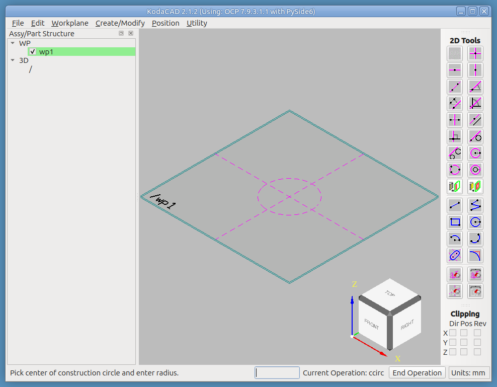

Once wp1 is created, we will draw a construction circle with its center at the origin and radius = 30. We won't need that construction circle yet, but will use it later in the tutorial.

### Create the Workplane Set

Next, click **Workplane -> Set...**

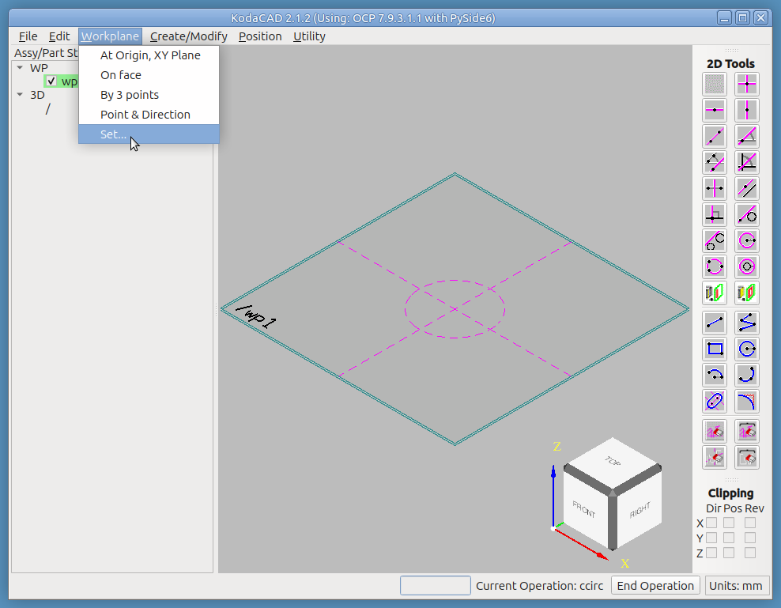

This launches a dialog which will allow us to specfy:
1. The total number of parallel workplanes that will be contianed in the set
2. The uniform spacing between the workplanes, starting with the space between the "Reference workplane" and the first of the workplanes in the set.

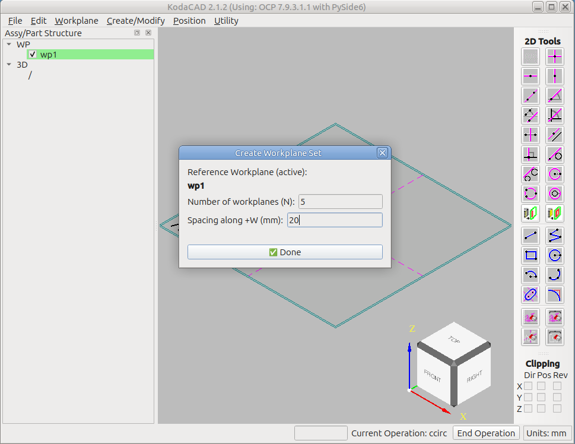

Clicking the "Done" button creates "s1", the set containing workplanes numbered wp2 through wp6. They are shown both in the viewport and in the tree. The last one created is currently shown "active", indicated by the green highlighting in the tree. Only the **Active workplane** can be drawn on. You are going to need to pay attention to this when you create the circular profiles in the next step.

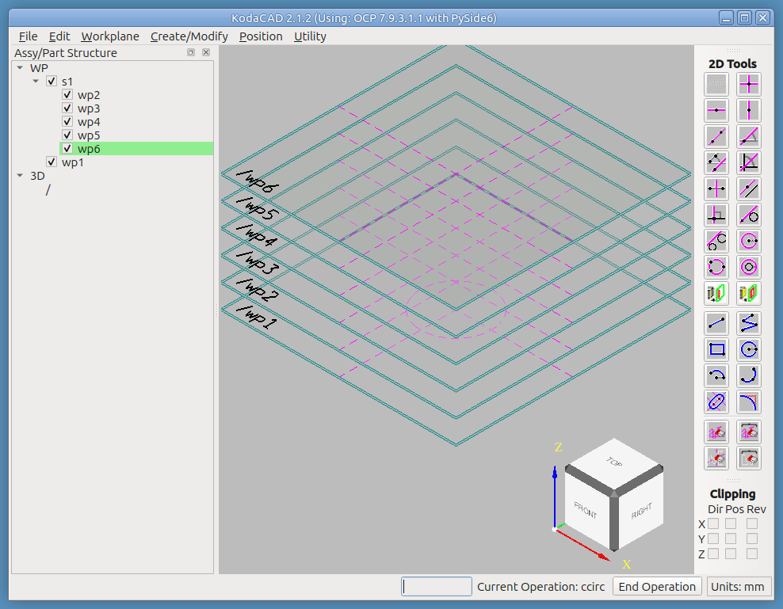

In this step, a circular profile is drawn on each of the workplanes. The centers are all located at the wp origin (where the horizontal and vertical construction lines intersect). The circle radii start at 15 mm (on wp2 & wp6) then go to 20 mm (on wp3 & wp5), and 25 mm on wp4.

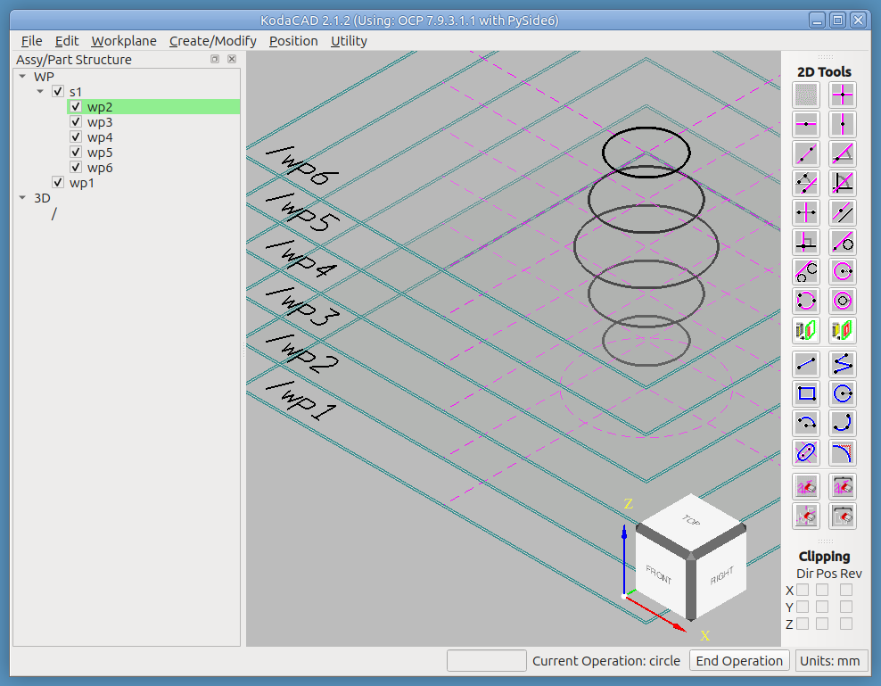

### Create the Empty Part for Lofting

After all the profiles are drawn, we need to create an empty part. RMB click on the **'/'** symbol in the tree, then choose **Create Empty Part**. Name it "inner-loft". It will be shown highlighted in yellow, indicating that it is the active part.

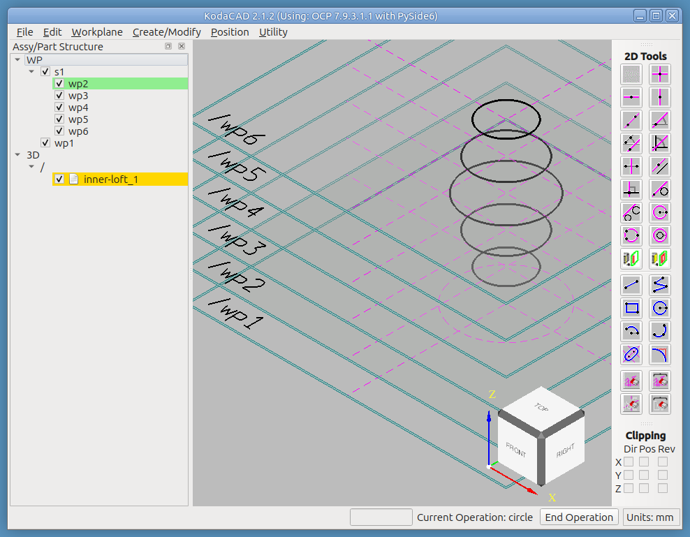

Once we have an active part and have a set containing an active workplane, go to the menubar and click **Create/Modify**. Then, click on **Loft** to generate the resulting lofted part.

This part will actually be used as a **subtractive** tool in the construction of the final result. The outer surface of this part will end up being the inner surface of the final resulting shape. We'll talk more later about why it's being done this way.

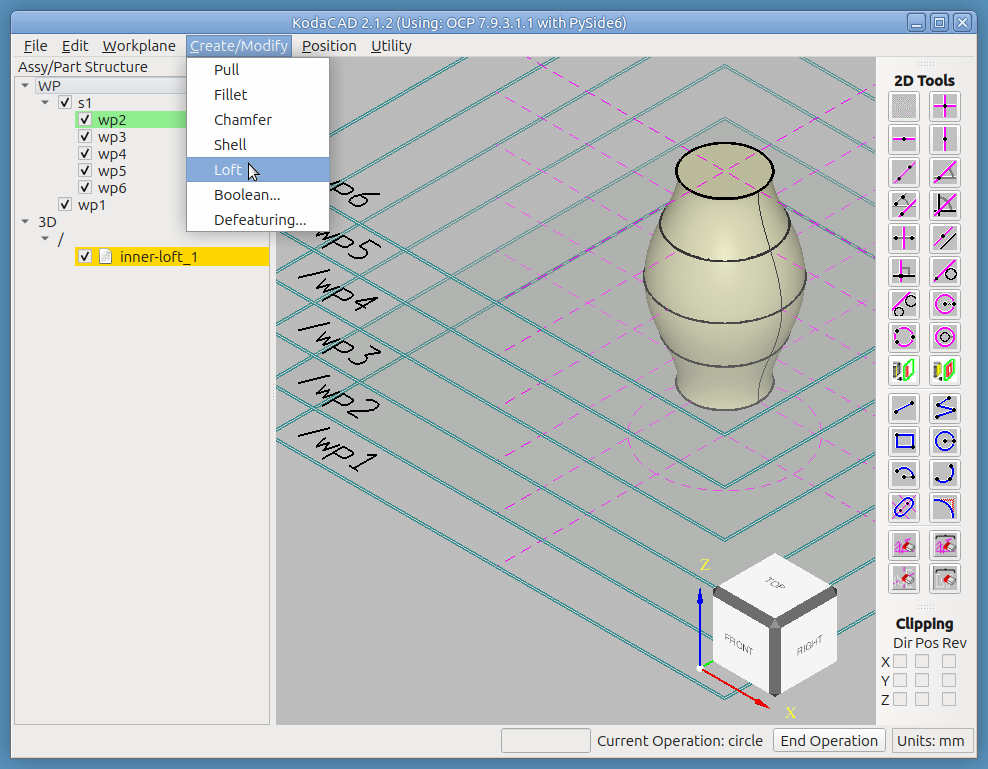

### Repeat the process to Loft the Outer Part

Next we are going to repeat the steps that went into creating the inner-loft and we will create the outer-loft part. In the screenshot below, you can see that we have created a 2nd set, s2, with circular profiles whose radii are 5 mm larger than the profiles used to create the inner-loft. The values of the new radii range from 20 mm at the ends to 30 mm in the center.

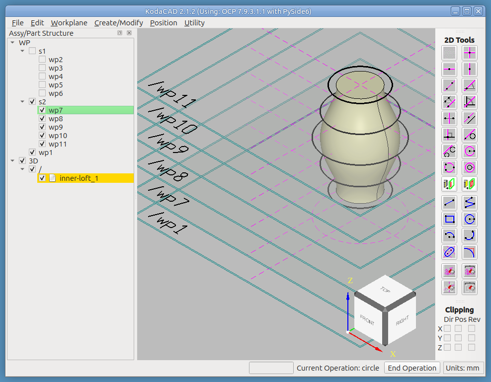

Again, once the profiles are drawn, the steps to create the loft are the same.
1. Create an empty part, and give it a name. It must be active.
2. Make sure one of the workplanes in the set to be be used is active.
3. **Create/Modify -> Loft**

At this point, we have created 2 lofted parts superimposed. We will do a boolean subtraction operation to *subtract* the inner one from the outer one, resulting in a 5 mm thick shell whose outer face and inner face were both created by lofting. Why go to the trouble of lofting the inner face? Why not just use the shell operation and set the thickness equal to 5 mm? The reason, as it turns out, is that when we subsequently add more features (operations) to the part, we may still want to be able to remove or modify those features using our **Defeaturing** functionality. For some reason, fillets and chamfers adjacent to a shelled face do not cooperate with the defeaturing operation. So we loft the inner face, just to be on the safe side.

### The Boolean Subtraction

With the outer part active, click **Create/Modify -> Boolean...**

This will launch the Boolean Dialog.
1. Choose Operation: Subtract
2. Choose Tool part: inner-loft_1
3. Make sure "Merge seam faces" is checked. This heals any "scar lines" that might occur where part edges of one part land on an otherwise smooth, continuous face of the finished part.

*Claude- I noticed that this dialog warns "The tool part is consumed by the fuse." even though we have chosen **Subtract** and not **Fuse**. I suggest we change this wording to "The tool part will be consumed by this operation." so that it will be applicable regardless of the operation selected.*

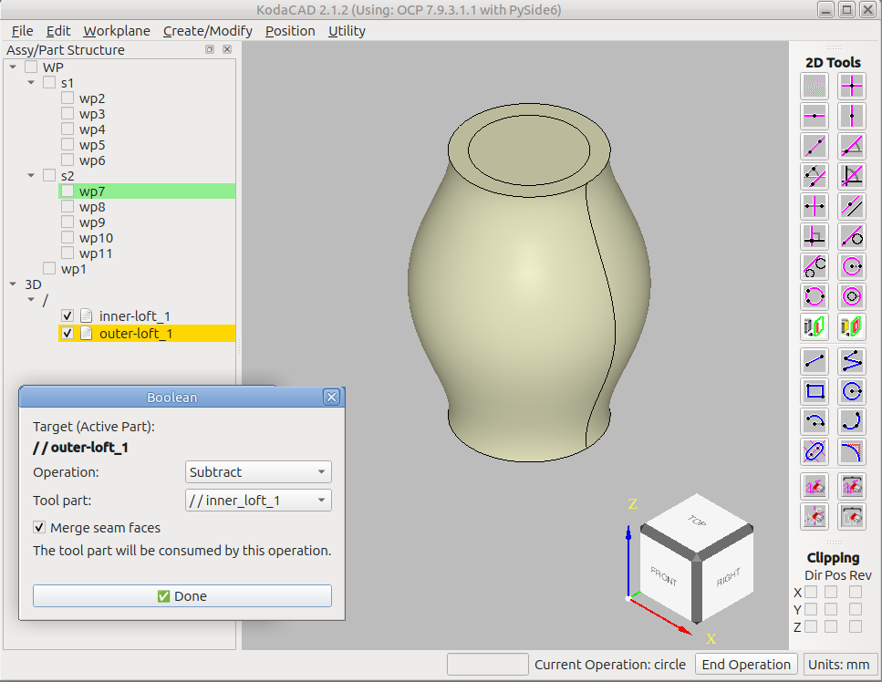

Clicking on the **Done** button completes the boolean subtract operation.

1. Now would be an excellent time to save the session. Saving the session creates a step file, which does a really nice job of saving 3D geometry and assembly hierarchy, but workplanes are not saved.
2. It would also be a good time to make sure the Undo steps that went into creating this lofted part are all available. Undo/Redo steps won't be available when re-loading a saved session file.

**Warning!!** If you click on the **Very Last Undo**, this wession will be **toast**. You won't be happy. Be sure to do step 1 before playing with this lit stick of dynamite!

The good news is that all the following steps in the tutorial can be easily performed by starting with the re-loaded session file.

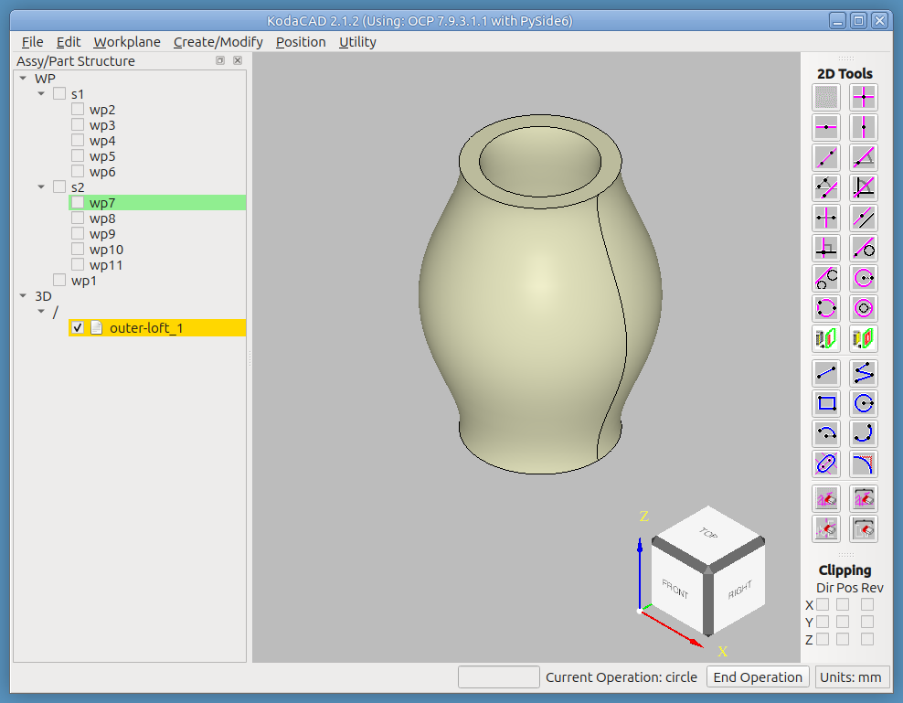

### Punching a transverse hole in the lofted part

At the beginning of the tutorial, when we created wp1, we made a construction circle, noting that we would use it later. Well, it's time. After making wp1 active, click **Workplane -> By 3 points**. Click first on the center of the construction circle on wp1 to specify the origin, then on the lower intersection of the circle and the vertical consruction line to specify the +W direction of the new workplane. Third, specify the +U direction by clicking on the right-side intersection of the circle with the horizontal consruction line.

After creating the new workplane, we want to draw a 10 mm radius circle profile on it, located at the center of the lofted part, as shown in the screenshot below. To aid in finding the center of the part, you can project the top and bottom faces of the part, then construct the bisector between them.

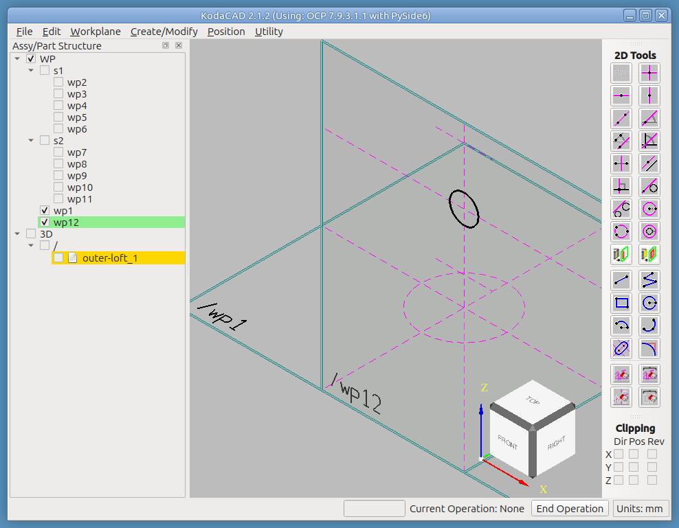

Now, with the new workplane active and with the lofted part active, click **Create/Modify -> Pull**. This will display the Pull Dialog. Complete the option selections as shown in the screenshot below.

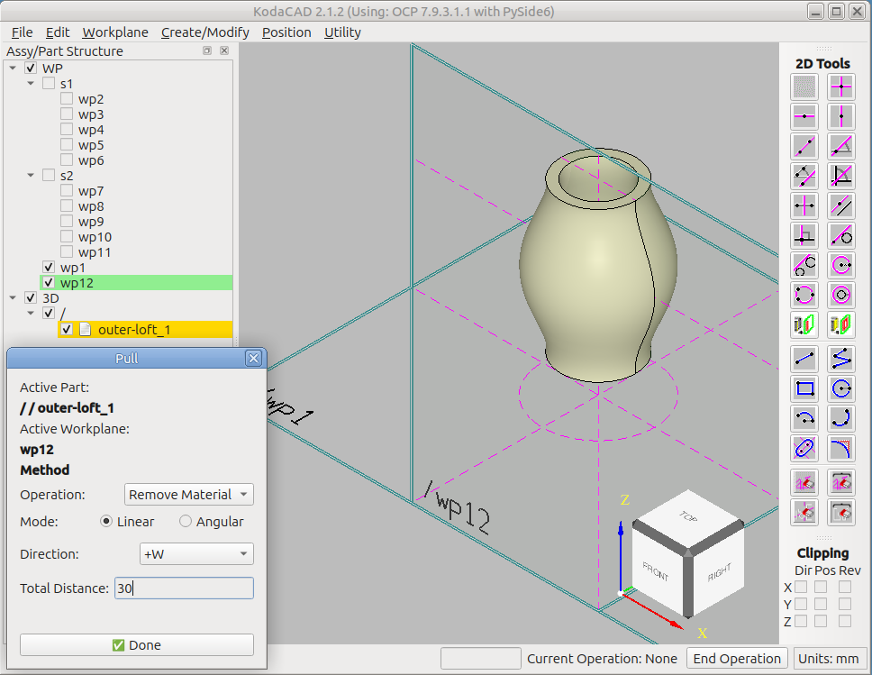

Click Done to create the transverse hole in the front face of the lofted part, as shown in the section view below.

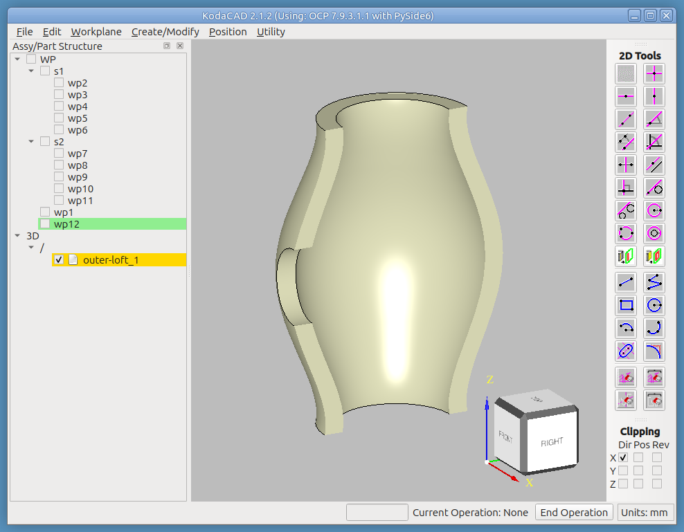

### Apply Fillets

It's now time to apply fillets (or chamfers) to all the sharp edges of the part, including the top, the bottom, and also around the perimeter of the transverse hole.

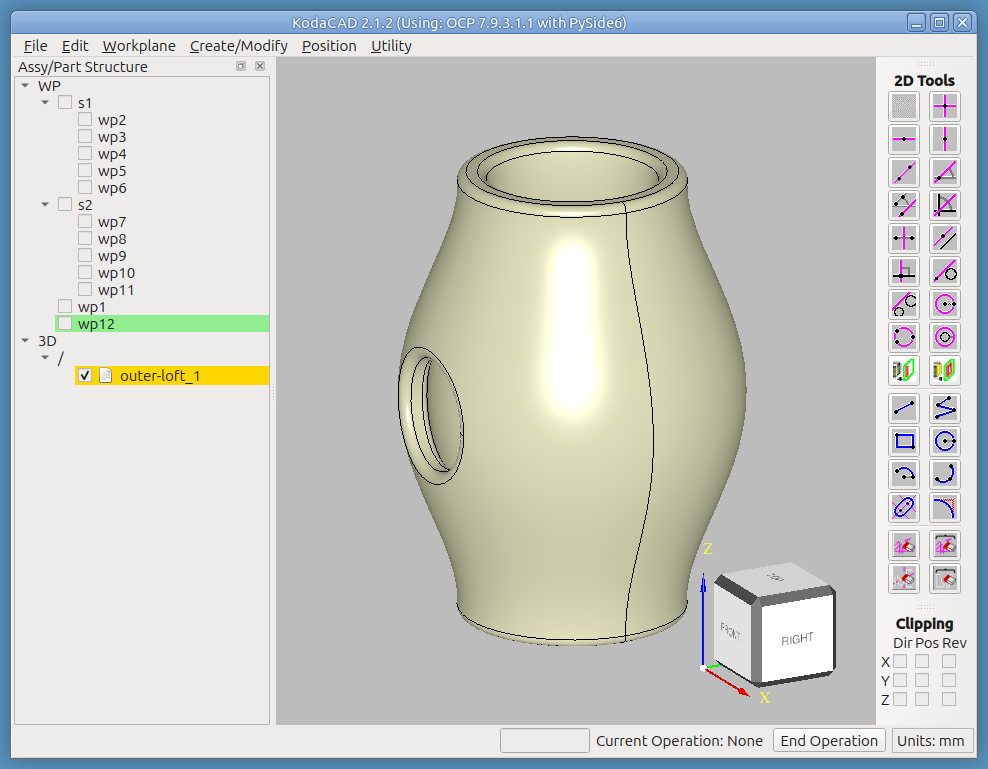

### Test Defeaturing

Once these fillets are applied, test that they can be removed using the defeaturing tools available by clicking **Create/Modify -> Defeature...**.

### Other Tests
Other tests include:
* Save/Load session
* Create shared Instance
* Create copy
