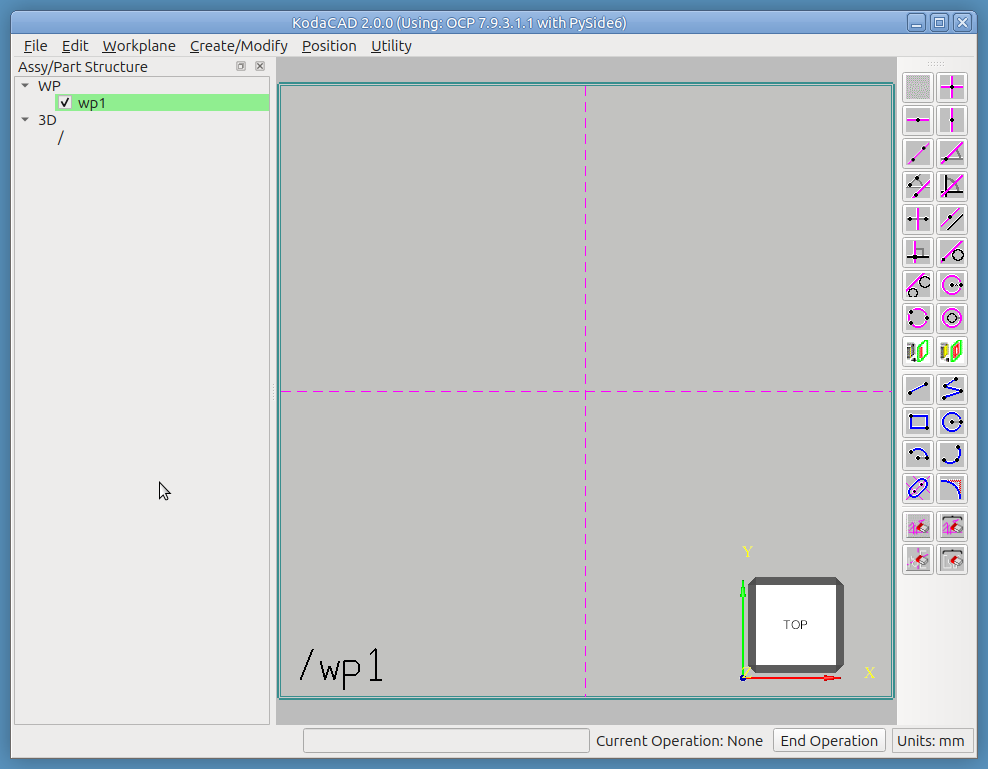
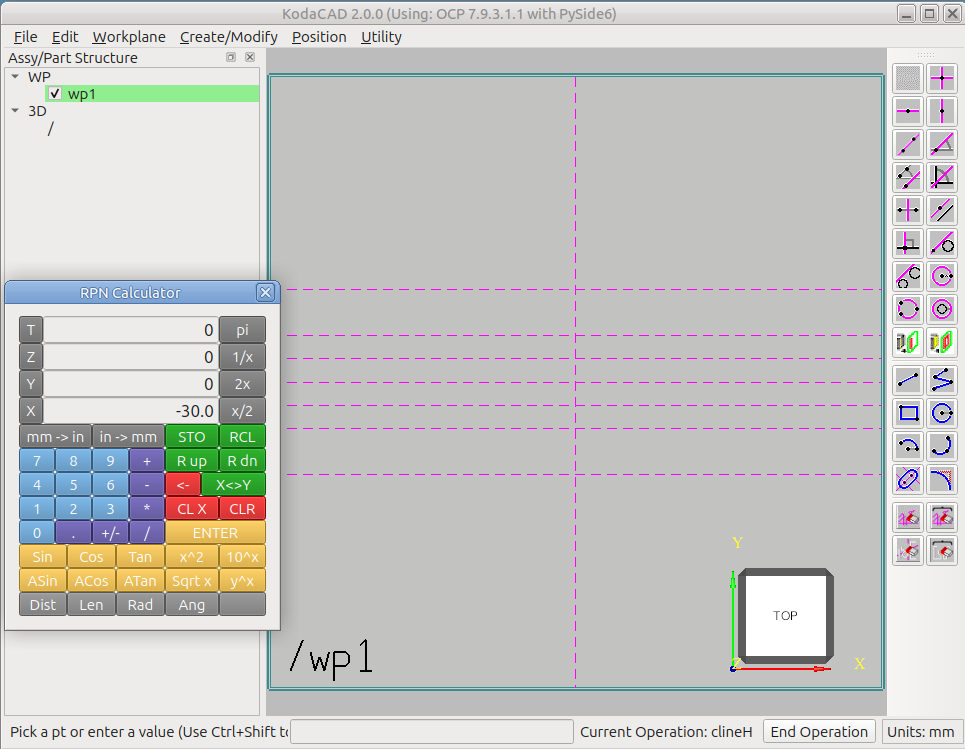
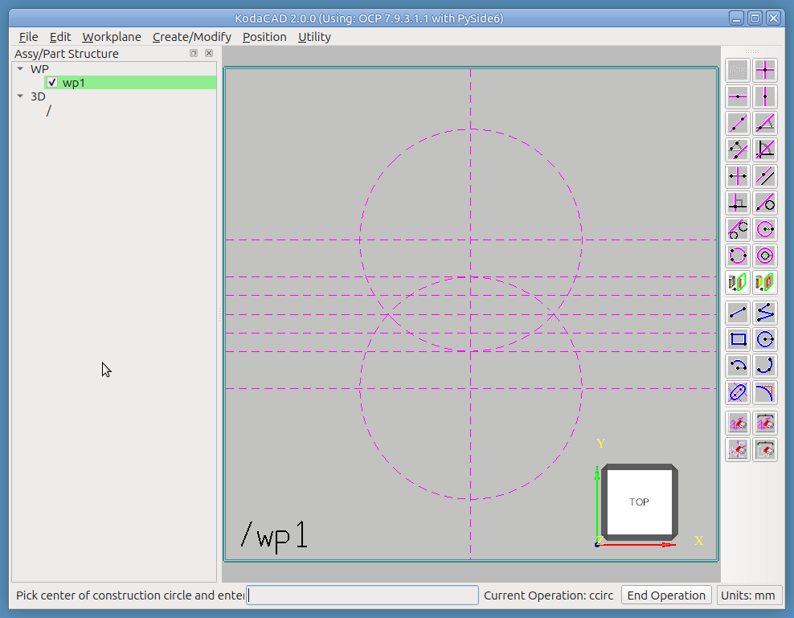
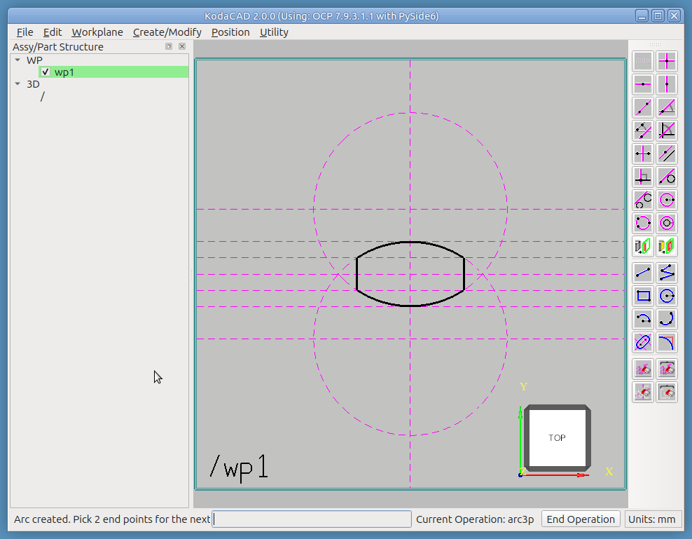
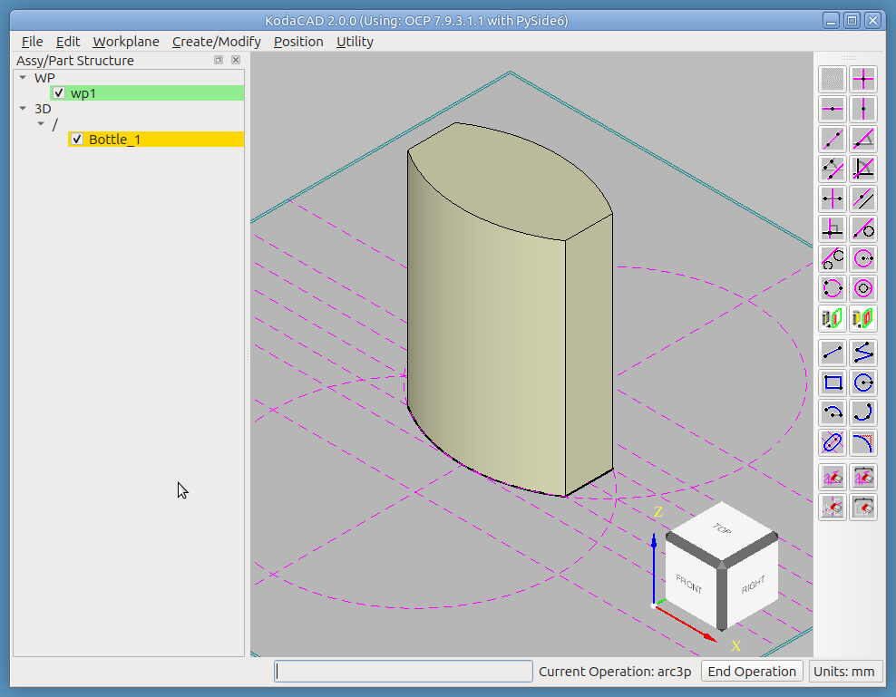
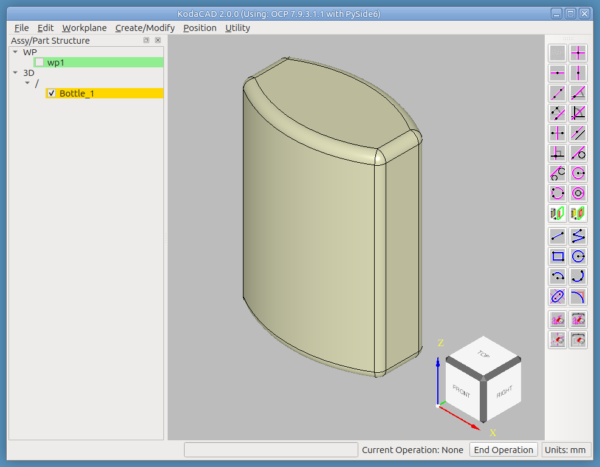
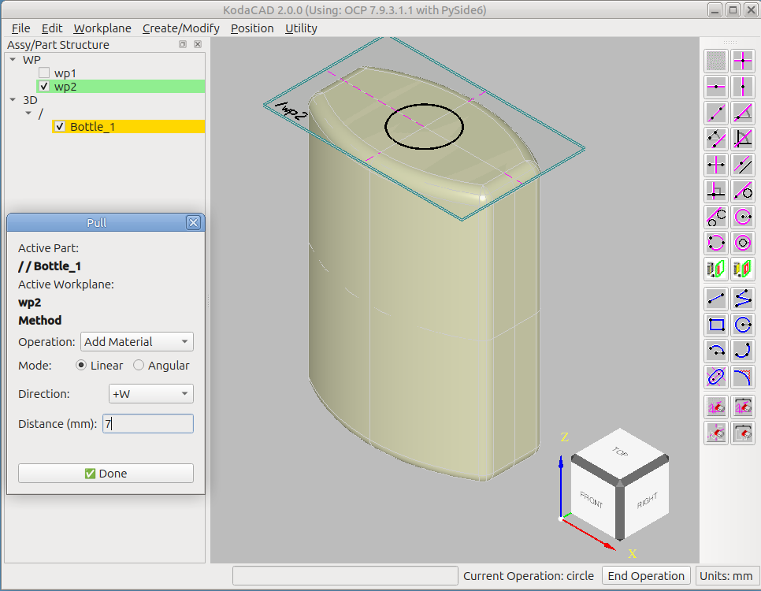
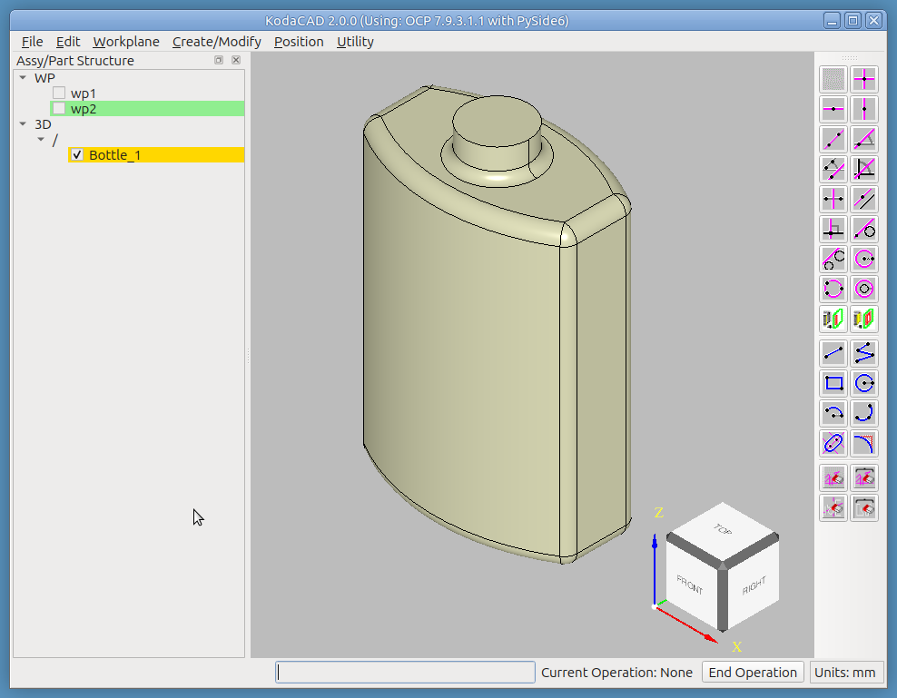
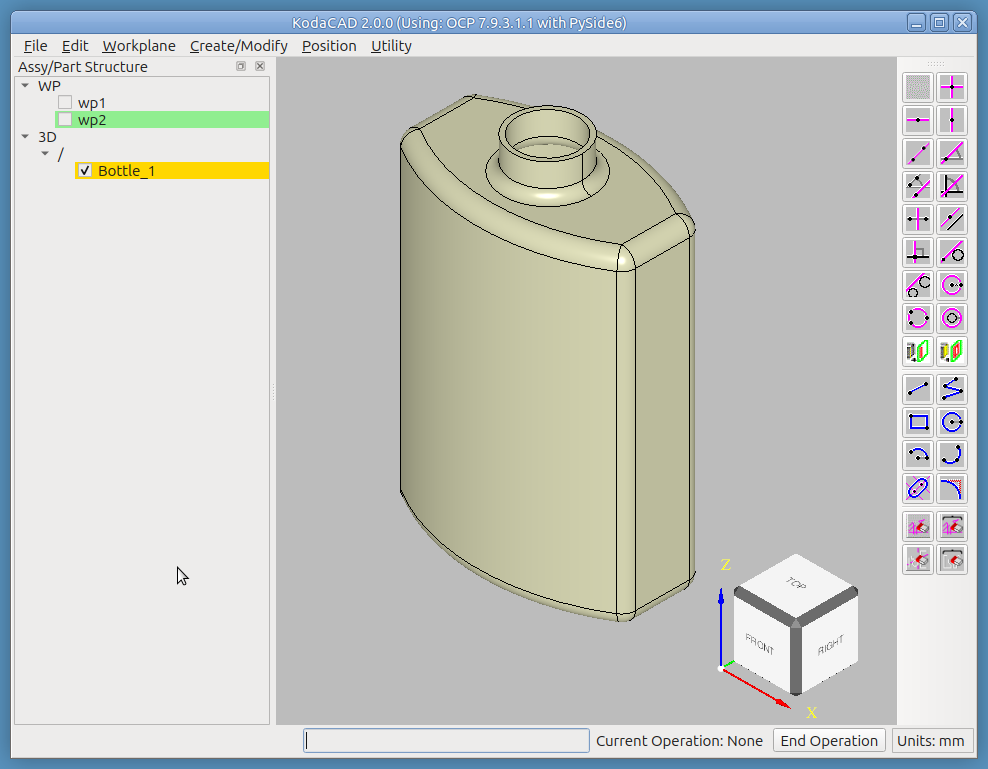

# Tutorial: Building the OCC Bottle in KodaCAD

This walks through building the classic [OCC Bottle](https://occt3d.com/dev/doc/overview/html/occt__tutorial.html)
(minus the threads) -- the shape used in OpenCascade's own canonical
tutorial -- entirely with KodaCAD's own tools. It's meant to double as
onboarding material for a new user and as a regression test: each step
is annotated with what it exercises, and the whole sequence is worth
re-running after any change that touches sketching, 3D creation,
Modify Active Part, or Undo/Redo.

## What you'll need

A fresh (empty) KodaCAD session. No file import required -- this is
built entirely from scratch.

## What this exercises

Workplane creation, the AIS ViewCube, the RPN calculator's
send-to-KodaCAD workflow, H/V construction lines, sketch geometry
(line, arc, construction circle), Extrude, Fillet (including its
edge-ownership resolution and the sample-and-verify fallback for
non-analytic circular edges), Mill/Pull, Shell, workplane visibility
surviving a modification, Undo/Redo across shape-replacing operations,
and STEP save/reload (file size, geometry round-trip).

---

## Step 1 -- Create a workplane on the XY plane

**Workplane -> At Origin, XY Plane**

A workplane appears in the X/Y plane, with Horizontal and Vertical
construction lines intersecting at the origin, ready to sketch on.

*Exercises: workplane creation, the auto-fit border/label cosmetics.*

## Step 2 -- Orient the view

Click the **top face of the AIS ViewCube** (bottom-right corner of the
viewport). The camera animates to a straight-down view of the
workplane -- the natural orientation for sketching its profile.

*Exercises: ViewCube face-click animation.*

## Step 3 -- Lay out reference construction lines with the calculator

This is a fast way to place a set of related H (horizontal)
construction lines at computed offsets, using the calculator as a live
scratchpad rather than re-typing each value by hand. Hovering the
cursor over any tool in the 2D sketch tools panel shows a **tooltip**
describing what it does.

* Click the **Horizontal Construction Line** tool in the 2D sketch tools
  panel.
  * The status bar prompts *"Pick a pt or enter a value"*.
  * "Current operation: clineH" is confirmed to the right of the
    status bar.
  * A *proposed* horizontal construction line follows the cursor in
    the viewport.
* In the **Utility** menu, click **Calculator** to open the
  calculator.
  * Use the calculator's keys to enter `30`, then click the **X**
    button (to the left of the value) to send it to KodaCAD -- this
    forwards the value straight to the armed tool, and an H cline is
    placed at y = 30.
* Press **x/2** (X register now reads 15), then **X** again -- a
  second H cline is placed at y = 15.
  * Press **x/2** again (7.5), **X** -- a third cline at y = 7.5.
  * Press **+/-** (X register flips to -7.5), **X** -- a fourth cline
    at y = -7.5.
  * Press **x2** (X register value doubled), **X** -- a fifth cline
    at y = -15.

Continue until you have a symmetric set of seven horizontal reference
lines at 30, 15, 7.5, 0, -7.5, -15, -30. The H cline tool stays armed
across multiple placements without needing to be re-selected. When
finished, either middle-click in the viewport or click **End
Operation** to exit.

Next, use the **Construction Circle** tool in the 2D sketch tools
panel to add two construction circles as shown below. Follow the
status bar's guidance: click the center, then a point on the circle.
When the cursor hovers near an intersection of construction geometry,
a small yellow square glyph appears -- those are the only places a
click is accepted. This supports one of KodaCAD's basic paradigms:

> In KodaCAD, accuracy is built into the sketch. You don't just make a
> freeform sketch and then add dimensions and constraints later.

*Exercises: the calculator's send-to-KodaCAD mechanism (the T/Z/Y/X
buttons -> valueFromCalc -> the currently-armed tool's callback), x/2,
x2, +/-, and chained tool use (a sketch tool stays armed across
multiple placements without needing to be re-selected); the
Construction Circle tool; the snap-engine catch glyph (the yellow
square) and its role in constraining picks to valid catch points
only.*

## Step 4 -- Sketch the profile

Use the **Line** tool in the 2D sketch tools panel to create two
vertical geometry-type line segments, as shown below. After drawing
these two lines, clicking the **Arc by 3 Points** tool automatically
ends the Line operation and begins the new one, ready to sketch the
two arcs. Again, follow the status bar's guidance -- click the arc's
end points, then a point on the arc. These four elements form a
**closed profile** of geometry-type lines, which will be extruded into
the 3D shape in the next step.

*Exercises: Line and Arc sketch tools; snap-to-construction-line
catching.*

## Step 5 -- Extrude the profile

**Create 3D -> Extrude**. Following the status bar's guidance, enter
`70` (the bottle's height) in the input field, then enter the name
`Bottle`. The bottle is added to the tree view as a child of `/`.
Clicking a corner of the ViewCube in the viewport switches to an
isometric view.

*Exercises: profile-to-solid extrusion, multi-loop face building.*

## Step 6 -- Fillet the vertical corners

The first workplane is no longer needed at this point. **Uncheck its
box in the tree to hide it -- don't delete it yet.** (A second
workplane is coming up in Step 7, so leaving this one hidden rather
than deleted sets up a check worth doing once both workplanes exist:
confirm this one is *still* unchecked, not silently re-shown.)

A few ways to adjust the viewport at any point:

* LMB drag to rotate
* MMB drag to pan
* RMB in the viewport -> **Draw -> Fit** to zoom to fill the viewport
* Click a face, edge, or corner of the ViewCube (only works when no
  operation is currently active)

Then:

* Set the new part active by RMB clicking it in the tree.
* **Modify Active Part -> Fillet**.
* Select all 12 edges of the bottle, one at a time -- the status bar
  acknowledges each one.
* Enter `3` as the radius.
* **Check the tree: confirm the first workplane is still hidden.**
  Any modification rebuilds the tree, which is exactly the moment a
  hidden workplane could silently reappear if its visibility state
  weren't actually being respected.

*Exercises: fillet's edge-ownership resolution at pick time; the
sample-and-verify circumcenter fallback if any of these edges aren't
typed as an analytic circle/line after display prep; workplane
visibility surviving a modification -- a hidden workplane used to
silently re-check itself on every tree rebuild, which every
modification triggers.*

## Step 7 -- Create a workplane on the bottle's top face

* **Workplane -> On Face**.
* Click the top face of the bottle to set the UV plane.
* Click one of the flat side faces to set the +U direction.
* A small workplane appears on the bottle's top face, its origin at
  the face's geometric center.

*Exercises: workplane-on-face.*

## Step 8 -- Create the neck of the bottle

**Sketch the circle profile**, centered on the top face:

* Use the **Circle** tool.
* Click the intersection of the H and V construction lines.
* Enter `7.5` as the radius.

**Extrude it upward**, with the bottle still active (highlighted in
the tree):

* **Modify Active Part -> Mill/Pull**.
* In the dialog: choose **Pull**, direction **+W**, distance `7` mm.

*Exercises: workplane-based circle sketching feeding directly into
Mill/Pull; a second, feature-adding operation on an already-filleted
part.*

## Step 9 -- Fillet the neck / top face

Hide this second workplane too (uncheck its box) -- it's no longer
needed. **Confirm both workplanes now show as unchecked in the tree,
and stay that way through the fillet below.** With the bottle still
active, add a 2 mm radius fillet at the base of the neck.

*Exercises: a second fillet operation on the same part, at a different
location and radius than Step 6's; workplane visibility surviving a
modification, now with two hidden workplanes at once rather than one.*

## Step 10 -- Shell the body

The final step is to shell the bottle, leaving the top open. With the
bottle still active:

* **Modify Active Part -> Shell**.
* Select the top face of the neck (the opening the bottle should
  keep).
* Enter `1` as the wall thickness.

*Exercises: face selection for Shell, `replace_shape`'s propagation to
the display.*

## Step 11 -- Undo the last few steps

Undo the Shell, then the neck fillet, then the Pull, then the first
fillet, one at a time, confirming each one visibly reverts before
redoing back to the finished bottle.

*Exercises: undo/redo's shape-vs-location redraw distinction --
Shell, Fillet, and Pull are all shape-replacing operations that don't
move the part, the specific case that needed its own fix (recording
the touched prototype's entry) separately from the location-comparison
fast path.*

## Step 12 -- Save and reload

Save the session as a STEP file, then reload it (or open it in a
second viewer) and confirm the geometry, and file size, both look
right.

*Exercises: the STEP writer's PCURVE-suppression setting; general
save/reload fidelity.*

---

## Notes for whoever runs this next

- If any step's status bar message, menu label, or tool name has
  changed since this was written, that's worth fixing here directly --
  this document drifting out of sync with the actual UI is exactly the
  kind of thing it's meant to catch.
- Consider adding a `Rad`/`Ang` measurement step once the bottle is
  built -- e.g. measure the neck's radius and confirm it matches what
  was sketched, exercising the calculator's measurement tools against
  a freshly-created (not STEP-imported) part.
- See also the [Assembly Structure tutorial](../as1-oc-214/README.md)
  and the [Quaoar Chassis tutorial](../chassis/README.md) for
  KodaCAD's assembly machinery -- this tutorial is deliberately
  single-part, and doesn't touch shared instances, reparenting, or
  the Position dialog at all.
- See the [Jack-o'-Lantern tutorial](../jack/README.md) for a fuller
  workout of the 2D sketch toolbar, and for this same
  extrude-then-heavily-fillet technique reused to build a pumpkin,
  followed by a real, multi-profile Mill/Pull operation this
  tutorial's own single-profile neck-pull doesn't demonstrate.
